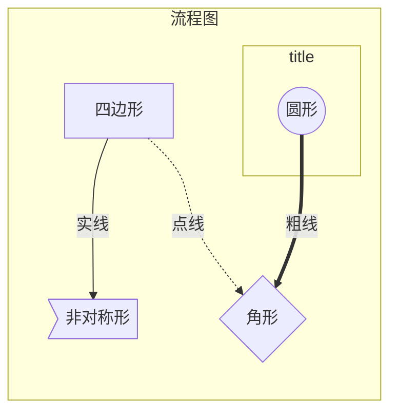
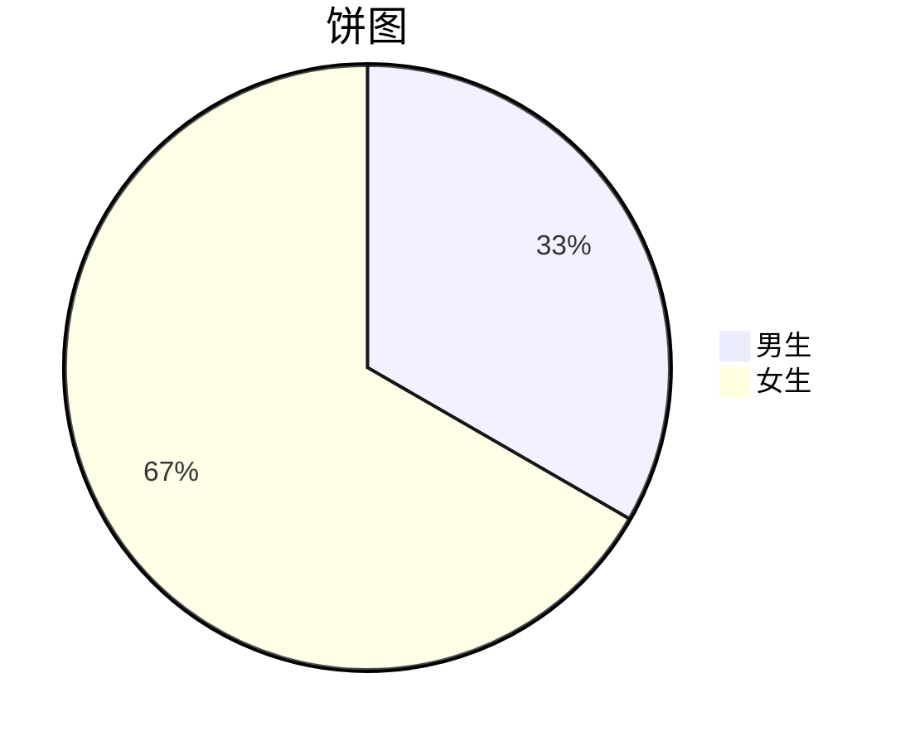

# 主题


# 流程图

## 结构

### 方向

- ``Top Bottom Left Right``
- ``graph TD/LR/TB/RL/../``
- 方向必须大写

### 节点

- 不加任何修饰的文字内容会被渲染成几何图形节点
- id[text]
- 形状
  - 圆形、圆角形、跑道形、气缸形、非对称形状、菱形、六角形、平行四边形、梯形
  - 四边形
    - 矩形
    - 平行四边形
    - 梯形
  - 圆形
    - 圆角形
    - 圆形
  - 角形
    - 棱形
    - 六边形
  - 非对称形
    - `` > ]``

### 连接线

- 线
  - 实线
  - 虚线
  - 粗线
- 箭头
- 文字

### 视图分组

- ```html
  	subgraph title
      	...
    	end
  ```

  

## 示例




### 链接

- [流程图](https://www.wenjiangs.com/doc/markdown-markdownflowchart) 常用于项目的需求分析和设计阶段，也较常出现于程序使用手册中。


# 时序图

## 结构

	### 类型声明

- `` sequenceDiagram ``

### 对象

- 别名
  - `` participant id as text ``
- 无需声明直接使用

### 消息

- 格式
  - ``[发起者][连线类型][接收者]:消息内容``
- 连接类型
  - 虚线 ` ->`
  - 实线 `->`
  - 箭头 `->>`
  - 交叉箭头 -x

### 激活框

- ` + - `

### 备注

- 格式
  - `note right of/left of/over 对象:text`
- 对象 可用逗号分隔，两个对象

### 语法

- ```
  关键词 condition
  	...
  end
  ```

- 循环 loop
- 条件 if
- 并行 par
  - and 连接

## 示例

- ```mermaid
  sequenceDiagram
      a->>+b: a ask b?
      b->>-c:b ask c?
      note over a,c:     note over a b c
      a->>c: a ask c!
      a->>a:2e
  ```

- [时序图](https://www.wenjiangs.com/doc/markdown-markdownsequencediagram)

# 饼图




[类图](https://www.wenjiangs.com/doc/markdown-markdownclassdiagram)