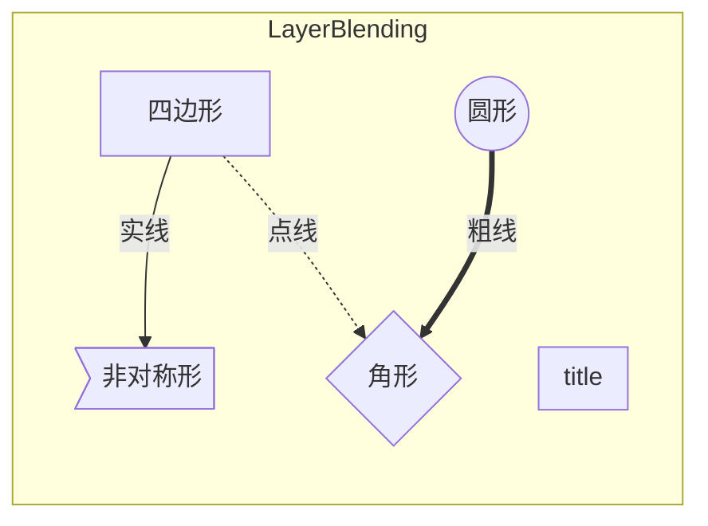

# 动画蓝图

## 动画图表

### 动画状态机

#### 动画 状态

#### 动画过渡曲线

## 事件图表

# 游戏动画

$$
GameAnim = 
SELECT(Direction * Speed * SELECT(Walk,Run,Fly,Climb,Crawl,Crouch) , Jump , Roll)
+ OverLay(Barral,Box,Rifle,...)
+ Additive(Lean)
\\
$$
(Name=AnimGraphNode_Root_1)

0x00007ffd2036eae0 {UnrealEditor-CoreUObject.dll!UObject::ProcessInternal(UObject *, FFrame &, void * const)}
0x000006a3580ed200 (Name=SpawnGameOwner)
0x00007ffd1cafb290 {UnrealEditor-AnimGraph.dll!UAnimGraphNode_LinkedAnimLayer::HandleInstanceChanged(void)}
## 基础层

- 站立
- 飞行
- 攀爬
- 爬行
- 蹲行
- ...

## 叠加偏移层

- 倾斜姿势
- 

## 叠加层

- 持枪
- 抱木桶
- 受伤

## 其他

- 跳跃
- 翻滚
- 

# 复合动画

## 动画混合

- 动画最好是循环的

- 动画长度不一致会导致混合异常

  - 需要同步组修改缩放来统一长度
  - 混合空间默认所有动画处于一个同步组

- 相当与动画插值

- $$
  \begin{array}{ll}
  BlendA1A2(alpha) = 
  \left\{\begin{array}{ll}
  A1 & alpha <= 0 \\
  (1 - alpha) * A1 +  alpha * A2 & 0 < alpha < 1 \\
  A2 & alpha >= 1
  \end{array}\right. \\
  Additive(alpha) = 
  \left\{\begin{array}{ll}
  A1 & alpha <= 0 \\
  A1 +  alpha * A2 & 0 < alpha < 1 \\
  A1 + A2 & alpha >= 1
  \end{array}\right.
  \end{array}
  $$

  
  

## 叠加动画

- 基础姿势
- 叠加动画 
  - 二者最好不要作用于同一个骨骼
- 输出  基础姿势 （基础绝对值）+  叠加动画（相对值）
- 方向
  - 需要状态机控制
- 大小、频率
  - 可由混合动画控制

## 瞄准偏移

- 同 混合空间

- 要求动画序列是**Additive**的

# 游戏动画

## 静止动画

## 移动动画

- 轮盘任意方向
- 移动速度 走 跑 冲刺
- 移动步伐 小步 碎步

## 叠加动画

- N Locomotion Cycle
  - Directional states
    - 六方向移动状态
    - 输入
      - StrideBlend 
        - 控制步伐大小
      - Walk / Run Blend
        - 控制步伐频率
      - PlayRateBlend
        - 控制步伐频率
        - 实现冲刺效果
      - Velocity ( F , B , L , R )
      - MovementDirection
        - Forward 、 BackWard 、Left 、 Right
    - 实现 
      - 步伐大小
      - 步伐频率 
      - 步伐方向
  - 
- ALS_N_Lean
  - 倾斜
  - 用于叠加动画
- 枚举动画
  - 一组动画选择一个播放

# 蓝图设计

## BaseLayer

### 

# 插件目标

## 用少量基础动画组合出真实的复合动画

