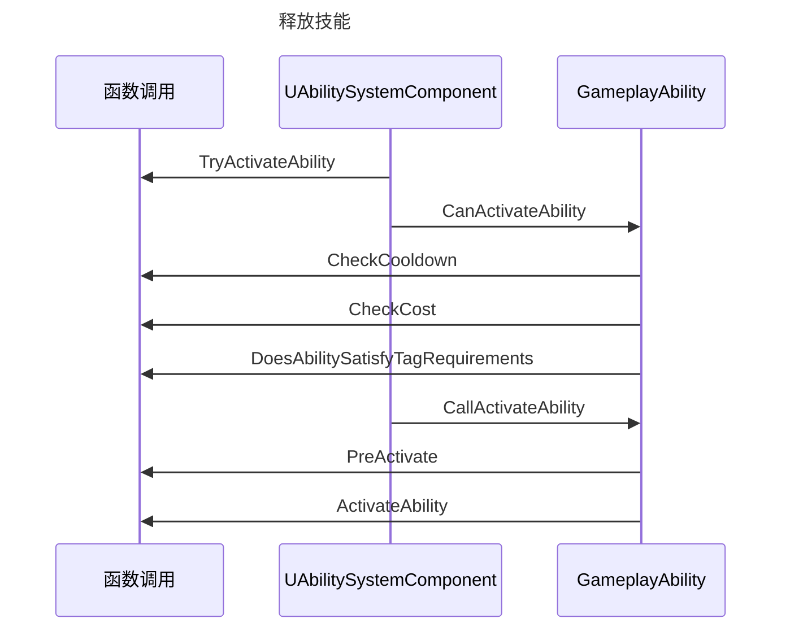

# 类

## Ability System Component

- ```c++
  class AActor OwnerActor;
  class AActor AvatarActor;
  class FActiveGameplayEffectContainer ActiveGameplayEffect;
  class FGameplayAbilitySpecContainer ActivatableAbility;
  
  AbilitySystemComponent->RegisterGameplayTagEvent(FGameplayTag::RequestGameplayTag(FName("State.Debuff.Stun")), EGameplayTagEventType::NewOrRemoved).AddUObject(this, &AGDPlayerState::StunTagChanged);
  
  virtual void StunTagChanged(const FGameplayTag CallbackTag, int32 NewCount);
  
  ```

## GA

## GE

## GC

## AS

```c++
运行时添加和移除AttributeSet;
AttributeSetClassName.AttributeName
```

### Attribute

```c++
BaseValue`和一个`CurrentValue
即刻(Instant)GameplayEffect可以永久性的修改BaseValue, 
而持续(Duration)和无限(Infinite)GameplayEffect可以修改CurrentValue. 
周期性(Periodic)GameplayEffect被视为即刻(Instant)GameplayEffect并且可以修改BaseValue.

AbilitySystemComponent->GetGameplayAttributeValueChangeDelegate(AttributeSetBase->GetHealthAttribute()).AddUObject(this, &AGDPlayerState::HealthChanged);
virtual void HealthChanged(const FOnAttributeChangeData& Data);

```

### Meta Attribute

临时值 Meta Attribute 用于 其他系统交互和修改

## Tag

## Task

## Event

# 流程

## 释放技能




