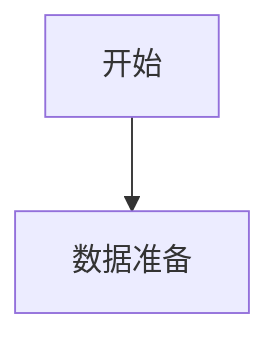

# 参考文献


[1]尚慧, 郑玉刚. 中国网络游戏产业发展现状的实证研究[J]. 改革与战略, 2009, 25(1):4.
- 基于NavMesh自动寻路算法在动态寻路问题上的研究
- https://www.docin.com/p-2314194365.html
- 基于Unity2017 NavMesh的智能寻路设计与实现
- https://wenku.baidu.com/view/4b4900c94a35eefdc8d376eeaeaad1f3479311d5.html
- 面向三维游戏场景的动态寻路算法的研究与应用
- http://www.doc88.com/p-6856180944049.html
- RTS游戏中的群体寻路系统
- https://www.bilibili.com/read/cv7494544
- https://www.gameres.com/665808.html
- https://blog.csdn.net/wubaohu1314/article/details/120472626
- https://blog.csdn.net/needmorecode/article/details/82050409
- https://zhuanlan.zhihu.com/p/20065737
- http://cdmd.cnki.com.cn/Article/CDMD-10384-1018257384.htm
# 地图表示法
$$
rhs(s)=
\begin{cases}
0& if  s=s_{goal}\\
min_{s’\in Pred(s)} (g(s’)+c(s’,s)) & \text{otherwise}
\end{cases}
$$

$$
\begin{array}{ll}
k_2(s) = min(g(s),rhs(s))         \\
k_1(s) = min(g(s),rhs(s))+h(s,s_{start})+k_m
\end{array}
$$


## 栅格法

## 四叉树法

## 八叉树法

## 可见点法

## 导航网格法

# Navmesh 

针对静态网格

RVO算法

## Recast

数据变化需要重新烘焙

## Detour

动态性能差

# 搜索算法

## A*算法

- 缺点
  - 基于节点之间的路径规划，结果路径是折线
  - 数据量过大时，效率低下
- 目标
  - 寻找平滑 可行的路径
  - 大地图数据分层

## LPA*算法


# 游戏场景设计

## 静态背景

- 地板
- 楼梯
- 斜坡
- 水池
- 梯子

# 游戏角色

## 动作

- 移动

- 跳跃

- 攀爬

- 游泳

  


$$
ConvRadius(i * i) =  \begin{Bmatrix}
   1 & 1 & 1 & ... \\
   1 & 1 & 1 & ... \\
   1 & 1 & 1 & ... \\
   ... & ... & ... & ... \\
  \end{Bmatrix} & i = math.floor(Radius)
  \\
ConvHeight(j) = \begin{Bmatrix}
   1 & 1 & 1 &1 & 1& 1& ... \\
  \end{Bmatrix} & j = math.floor(HalfHeight)
$$

# 流程图





```mermaid
graph TB
	1(物体) --> 2(光栅化)
	H2 --> F1[序列化]
	H2 --> F2[热更新]
	H2 --> F3[构造函数]
	H2 --> F4[注册UCLASS]
	H2 --> H3(宏 DECLARE_CLASS)
	
	F1 -->FF11[/operator >>/]
	F1 -->FF12[/operator <</]
	
	F2 -->FF21[/__VTableCtorCaller/]
	F2 -->FF22[/Class/]
	
	F3 -->FF31[/__DefaultConstructor/]
	
	F4 -->FF41[/StaticRegisterNativesUTest/]
	F4 -->FF42>Z_Construct_UClass_UTest_Statics]
	FF42 -->FF42S[友元结构体]
	FF42-->FF421[DependentSingletons]
	FF42-->FF422[FuncInfo]
	FF42-->FF423[PropPointers]
	FF42-->FF424[ClassParams]
	
	FF41-->PFF41[/注册函数指针/]
	
	H3 -->ope[operator]
	ope -->new[/new/]
	ope -->delete[/delete/]
	ope -->=[/=/]
	
	H3 -->F5[UCLASS函数]
	F5-->FF51[/StaticClass/]
	F5-->FF52[/GetPrivateStaticClass/]
	FF51-->FF52
```

- UE4接口

  ```mermaid
  sequenceDiagram
  title: 注册物体到导航系统
  participant Functions as 函数调用
  	Functions->>UWorld:SpawnActor
  	UWorld->>AActor:PostSpawnInitialize
  	AActor->>AActor:RegisterAllComponents
  	AActor->>UActorComponent:RegisterComponentWithWorld
  	UActorComponent->>UPrimitiveComponent:OnRegister
  	UPrimitiveComponent->>FNavigationSystem:OnComponentRegistered
  ```

  

  ```mermaid
  sequenceDiagram
  title: 移动物体动态更新寻路系统
  participant Functions as 函数调用
  	Functions->>USceneComponent:修改坐标
  	USceneComponent->>UPrimitiveComponent:MoveComponentImpl
  	UPrimitiveComponent->>USceneComponent:PostUpdateNavigationData
  	USceneComponent->>FNavigationSystem:OnComponentTransformChanged
  ```

  ```mermaid
  classDiagram
  	class UPrimitiveComponent{
  		所有组件的基类
  	}
      class UActorComponent{
      	各种不同功能的组件
      }
      UPrimitiveComponent <|-- UActorComponent
  ```

  

