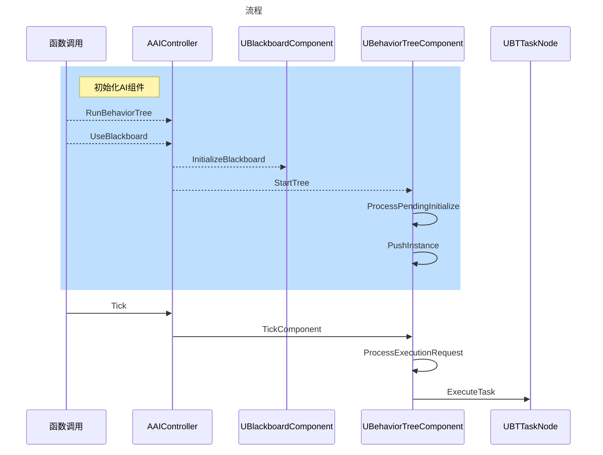

# 游戏世界

## 模型

### 白模

- 点
  - 由 图 + 算法 + 深度学习 得到点阵
- 面
  - 由算法 + 深度学习 得到最简洁的面

## 纹理

### 贴图

UV展开

插值、滤波

MipMap

压缩技术

### 贴图加载

纹理流送

虚拟纹理

## 材质

### 着色模型

纹理贴图与光照模型

### 编译

自定义矩阵表达式

HLSL语言，实现动态逻辑

### 材质纹理

- 基础颜色
- 金属度
- 光滑度
- 法线

## 动画

### 物理动画实现

物体会受到力，会具有速度属性，通过物理计算实现

#### 整体运动

物体质心平移、旋转、缩放

#### 局部运动

物体上的每一个点的平移、旋转、缩放

点蒙皮绑定骨骼，跟着骨骼平移、旋转、缩放

### 模拟动画

有些动画用物理模拟过于复杂，只能通过定义中间状态，然后插值实现

这样的中间状态是和环境高度相关的

 简单物体直接定义每一个点的中间状态

复杂物体可以通过骨骼绑定，骨骼约束批量定义点的中间状态

复杂物体可以定义关键点的中间状态，其他点的中间状态通过插值得到

动作捕捉可以得到真实的中间状态

### 动画混合

动画是某一状态下的运动表现，且状态之间也存在约束关系

但是状态叠加和转化时，动画也需要变化

通过动画状态机实现任意状态时的动画混合

## 物理

实现碰撞查询、物理约束、物理材质模拟

### 刚体

形状和大小不变

### 粒子特效

模型的点组成会变化，需要用粒子来模拟微观层面下的模型

#### 破碎

#### 布料

#### 爆炸

#### 流体

### UI动效

变换纹理和刚体运动来实现UI界面下的运动效果

## 智能

定义在某一条件下，智能体的决策

### 单体智能

通过行为树或状态机实现任意条件下的决策

这是抽象程度较高的决策需要转化为具体的行为

- 寻路 实现 从A 到 B的转化

### 团结合作

在单体智能之上安排团队指挥者来改变单体的条件

AOV避障、阵型

# 游戏开发

## UI 

### Slate

继承关系

- SWidget

  - 属性

    - Slot
      - Anchors
      - Parent
  
  - SLeafWidget
  
    - STextBlock
    - SImage
  
  - SCompoundWidget
  
    - SWindow
  
      - 独立窗口容器
      - 窗口通信
  
    - SPanel
  
      - SOverlay
        - 可重叠的容器
      - SBoxPanel
        - SVerticalBox = MenuBar
        - SHorizontalBox 
  
    - STableViewBase
  
      - SListView
        - STreeView
  
    - SBorder
  
      - 带边框的容器
      - SButton
  
      - SDockTab
        - 容器可以被选中拖动
  
    - SProperty
  
      - SPropertyEditorSet
      - ....

常用控件

- SHorizontalBox 、SVerticalBox
  - 水平布局、垂直布局

- STreeView、SListView
  - TreeItemsSource
    - 树形数据
  - OnGenerateRow
    - 由行数据自定义行表现UI与事件
  - OnGetChildrenRow
    - 如何获取子类行数据
- Dialog
  - 消息对话框
  - SGenericDialogWidget
- FNotificationInfo
  - 弹出消息提示

编辑器扩展

- IPropertyTypeCustomization
  - 属性面板
    - LayoutDetails
    - CustomizeHeader
    - CustomizeChildren
- IDetailsView
  - 细节面板
    - CustomizeDetails

  - FDetailWidgetRow
    - NameContent
    - ValueContent

- FAssetEditorToolkit
  - MenuBar
    - 只有一个位置，是共用的
    - FMenuBarBuilder
      - AddPullDownMenu
      - AddMenuEntry
      - AddMenuSeparator
    - UICommandList
      - FUICommandInfo
      - FExecuteAction
  - ToolBar
    - FToolbarBuilder
      - AddToolBarButton
  - FTabManager::FLayout
    - 布局
      - 水平分割
      - 垂直分割
    - FStack
      - FTab
        - RegisterTabSpawner
        - SDockTab

### Slate 更新

- 每一帧都会重新绘制
- 休眠状态不绘制
  - 没有用户输入
  - 没有执行活跃定时器
    - 定时执行更新

### UserWidget

UObject

- UVisual
  - UWidget
    - 属性
      - TSharedPtr<SWidget>
      - AddToViewport
        - setparent
    - UPanelWidget
      - UContentWidget
        - UButton
    - UUserWidget
    - UImage
- AActor
  - AHUD
    - 属性
      - 不可交互的UI元素
      - UCanvas
        - 在画布上画线画文字
  - UWidgetComponent

### UI 框架

游戏代码编写规范、方便使用

层次结构

- UI组件
  - 组件数据绑定、更新
  - 事件更新
  - 各种表现效果
- UI页面
  - 可以不需要
  - 组件组合与布局
  - 实现组件之间的逻辑
- UI界面
  - UI组件、页面布局
  - 实现页面、组件的逻辑
- 界面管理器
  - Stack界面层级
    - 互相覆盖
    - 仅显示当前
  - 界面状态管理
    - 进入
    - 显示
    - 隐藏
    - 退出
- UIControler挂载在UI页面实现对外接口
  - 实现源数据的获取接口
  - 负责监听数据更新
  - 实现数据转化和绑定

功能

- 数据绑定、更新
- 事件管理
- 生命周期
- 组件定义

数据和视图分离、性能分析、逻辑清晰

### 编辑器扩展

#### C++扩展

- IHasMenuExtensibility
- IHasToolBarExtensibility
- FExtender
  - AddMenuExtension
  - AddMenuBarExtension
  - AddToolBarExtension
- EditorModule.GetMenuExtensibilityManager()->AddExtender(Extender)
- EditorModule.GetToolBarExtensibilityManager()->AddExtender(Extender)

#### 蓝图扩展

蓝图 Editor Utility Blueprint

class EditorUtilityToolMenuEntry

[**Blutility**](https://docs.unrealengine.com/4.26/zh-CN/ProductionPipelines/ScriptingAndAutomation/Blueprints/ScriptedActions/)

#### Python 扩展

[Pyton](https://docs.unrealengine.com/4.26/zh-CN/ProductionPipelines/ScriptingAndAutomation/Python/)

## AI

### 行为树 - 由事件驱动

类图

- AAIController
  - UBehaviorTree
    - UBlackboardData
  - UBlackboardComponent
  - UBehaviorTreeComponent
    - UBTTaskNode
      - UBTTask_BlueprintBase
    - FBehaviorTreeInstance
    - 同树同任务同实例

组成

- 行为树
  - 复合节点
    - 流程语句
  - 叶子节点
    - 任务语句
  - 装饰器
    - 条件语句
  - 服务节点
    - 以某一频率执行
- 决策
  - 是一个过程

### 寻路系统

点到点的寻路

转化为 三角面到三角面的寻路

额外功能

- 寻路修饰体积
  - 寻路区域
    - 设置寻路代价
- 寻路链接代理
  - 跳跃
  - 连接不相邻的面片
- 动态生成寻路网格体
- AI控制器
  - 设置查询筛选器
    - 选择寻路区域
    - 重载区域开销

### 场景查询系统

- 生成器
  - 按规则生成采样点
- 测试
  - 对采样点测试打分

### AI感知

感知类型

- 视觉
- 听觉
- 触觉

触发事件

知道物体是否在感知中

## 物理

分为物理检测和效果模拟

碰撞

- 包围盒
- 

约束

- 两个物体受物理作用相互影响
- 物理阻尼
  - 物体受介质影响移动越来越慢
- 物理材质
  - 实现物体表面约束

## 输入

处理流程

- AController
  - BuildInputStack
    - APawn
    - ALevelScriptActor
    - APlayerController
    - ENableActor

输入绑定

- C++

  - InputComponent->BindAxis

  - I nputComponent->AddActionBinding

- 蓝图
  - EnableInput
    - UInputDelegateBinding::BindInputDelegates
    - 按蓝图函数名字绑定

## 动画

### 播放动画

### 动画蒙太奇

### 动画通知

### UI动画

## 网络同步

### 接口

- GetLifetimeReplicatedProps
  - 定义哪些属性需要同步
- 有一些Actor是由当前玩家控制，一些是由其他玩家及服务器控制
  - 需要做出不同的响应
- 每个需要复制的UObject对象会有一个NetGuid

# 游戏框架

- Level
  - GameMode
    - PlayerController
      - 管理 Pawn 、PlayerCameraManager
    - Pawn
    - PlayerCameraManager
      - ViewTarget
      - 配置相机属性 POV、空间信息

# 引擎开发

## 文件系统

- Asset Package
  - 一个资源文件就是一个UObject对象
  - 一个资源文件可能包含多个文件
  - 多个资源文件组合成资源包 （某一路径下的所有资源）
- Mount、Load
  - Mount 提供虚拟路径访问Pak

## 服务器开发

## Lua 交互
