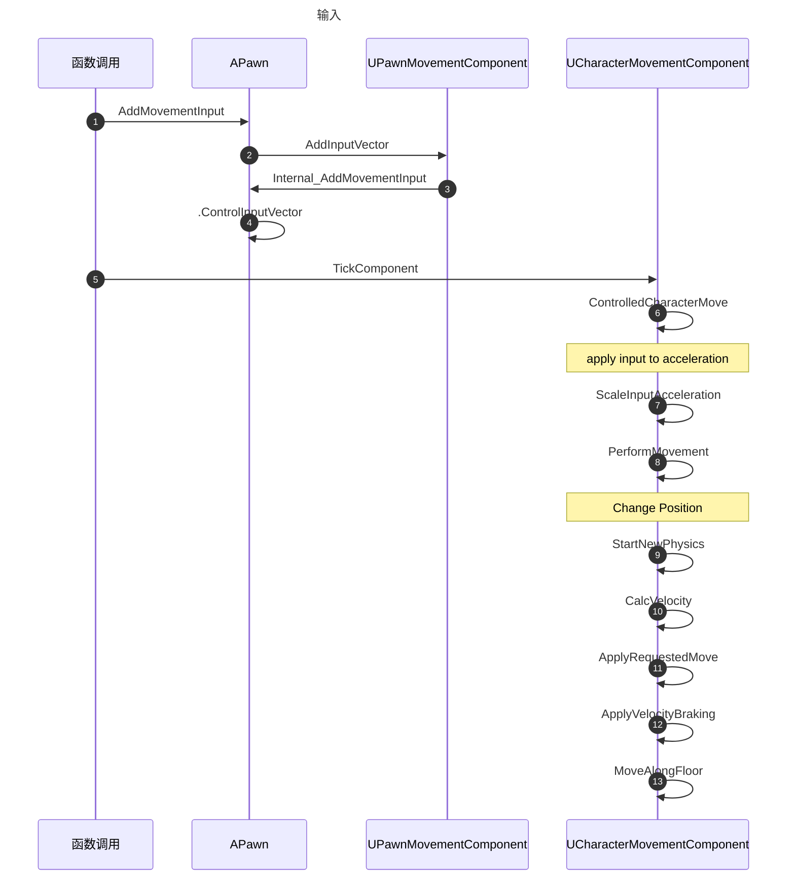

# 类

- UCharacterMovementComponent
  - UPawnMovementComponent
    - UNavMovementComponent v
      - UMovementComponent
        - UActorComponent
- APawn

# 输入

https://www.freesion.com/article/2884235638/

