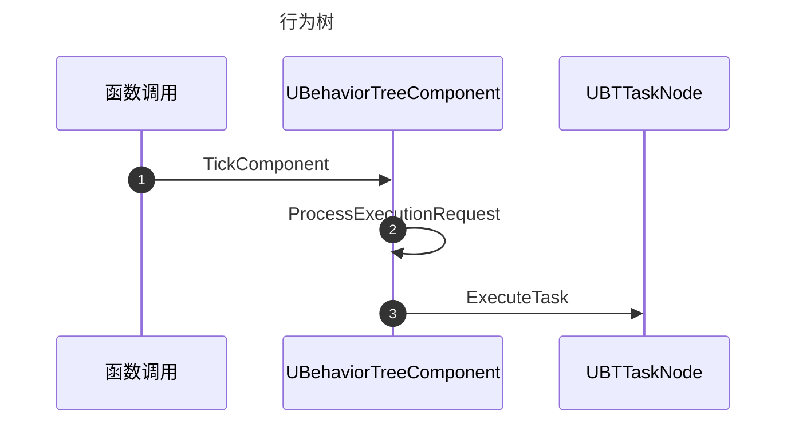
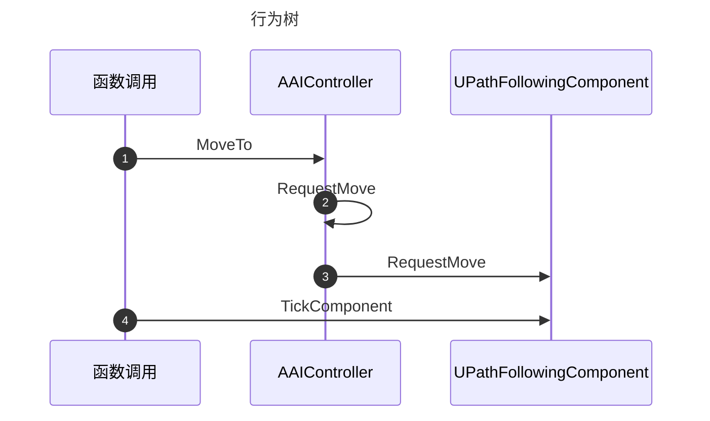

# Classs
## AIController

## BehaviorTree

## BlackBoard

## BTTaskNode

# 流程图

# 游戏寻路

## Class

- UAITask_MoveTo
- AAIController
- FAIMoveRequest

## 寻路角色

- 大小
- 能力

## 游戏地图

- 游戏网格
- 多边形
- 障碍物

## 邻域扩展

- 扩展方向
- 判断是否可行
- 

## 代价函数

- 

## 寻路系统

- 四方向移动二维地图
  - 只能划分导航网格
- 任意方向二维地图
  - 可使用多边形导航网格优化加速
- 二方向加跳跃二维地图
  - 导航网格法
- 行走任意方向三维地图
  - 可使用多边形导航网格优化加速
  - 加入跳跃
