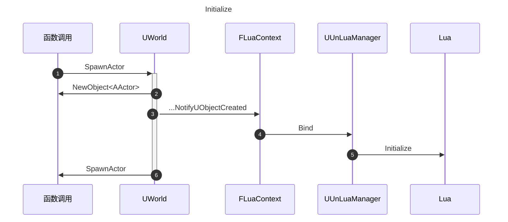
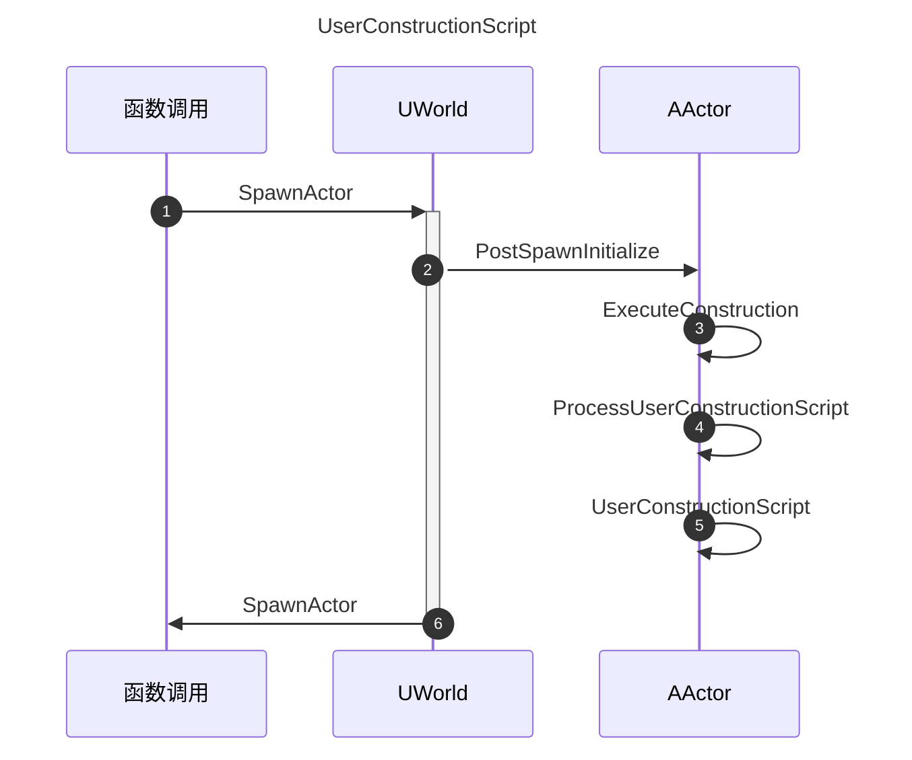
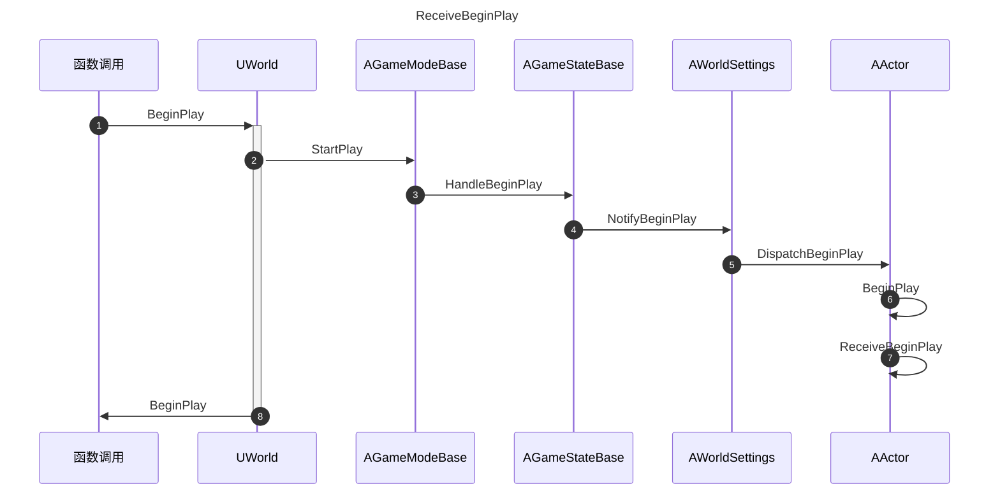
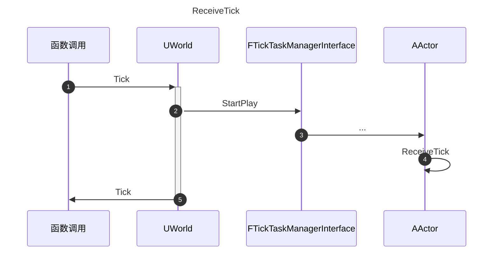
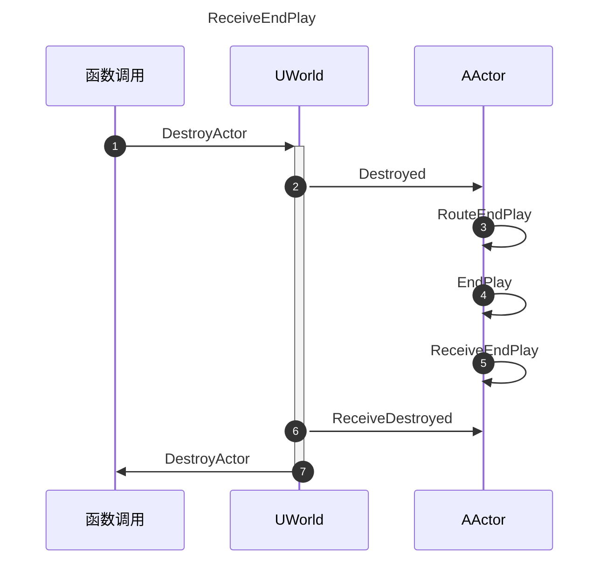

# World

## InitializeActorsForPlay

AGameMode ->InitGame

## BeginPlay

## Tick

# Level

## Serialize

# Actor

## Initialize

## UserConstructionScript

## ReceiveBeginPlay

## ReceiveTick

## ReceiveEndPlay

# Object

## Destory

