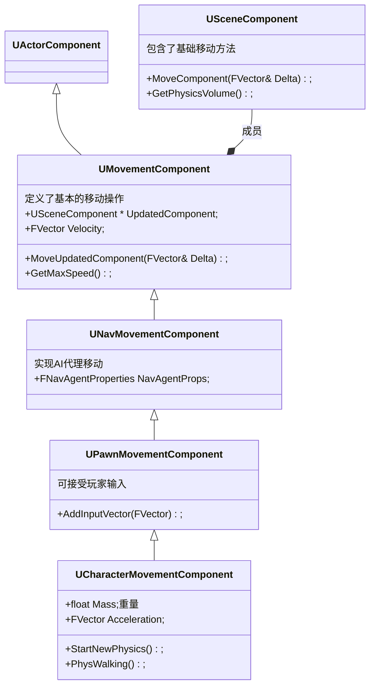

# 移动物体

##  Actor

```c++
Actor->SetActorLocation();
AActor::AddActorWorldOffset(); // Actor沿着某个世界坐标系方向移动
AActor::AddActorLocalOffset(); // Actor沿着当前Actor局部坐标系方向移动
//如果使用AddActorWorldOffset或者AddActorLocalOffset移动Character，那么MovementMode必须设置为fly，否则当DeltaLocation较小时，角色会始终往下掉（即使禁用物理模拟）
```

## Pawn

```c++
Controller->MoveTo();
GetWorld()->GetNavigationSystem()->SimpleMoveToLocation(Controller, DestLocation);
APawn->AddMovementInput(FVector WorldDirection, float ScaleValue = 1.0f, bool bForce = false);
```

## Character

```c++
ACharacter->GetCharacterMovement()->Velocity += FVector(5.f, 5.f, 0.f);
void UCharacterMovementComponent::AddImpulse( FVector Impulse, bool bVelocityChange );
//AddImpulse 一般用来做投掷、爆炸、击飞等物理效果。添加的是一个瞬间的力，之后就不需要每帧做处理了。
void UCharacterMovementComponent::AddForce( FVector Force )
```

## Component


```c++
FLatentActionInfo ActionInfo;
ActionInfo.CallbackTarget = this;
UKismetSystemLibrary::MoveComponentTo(TopDownCameraComponent, Location, Rotation, false, false, 1.f, true, EMoveComponentAction::Move, ActionInfo);
// 一般用来移动Actor身上的Component，例如CameraComponent等。支持平滑移动，可以设置移动到目标Location、Rotation过程的时长。
```


# Class





# 精确移动

- SetPosition
- SetLocation

# 模拟移动

- Acceleration
- Velocity

