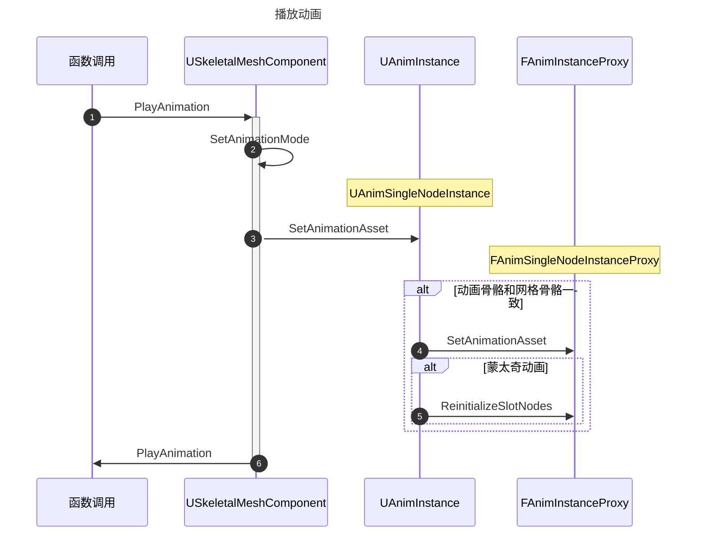
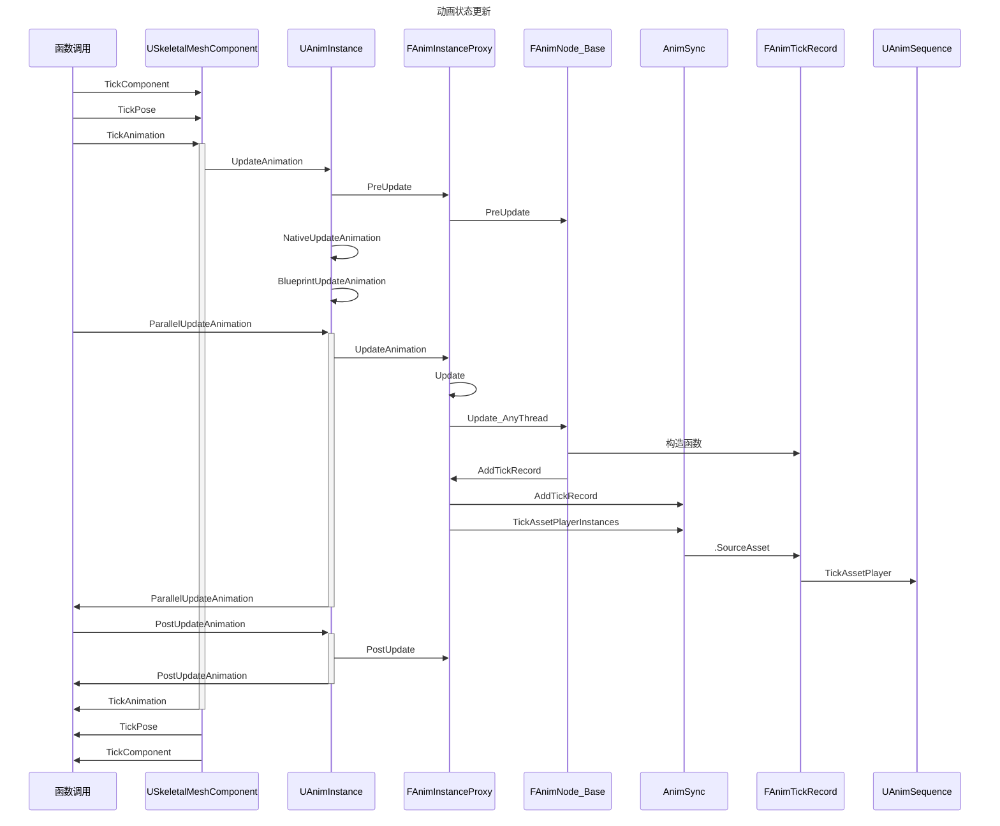
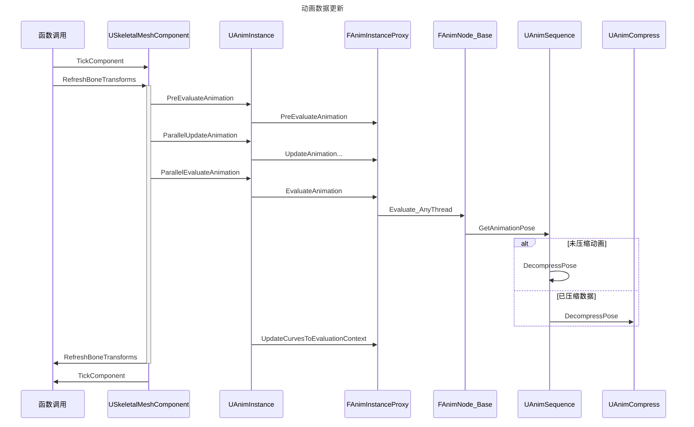
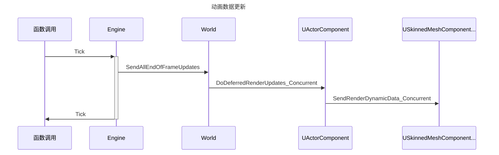
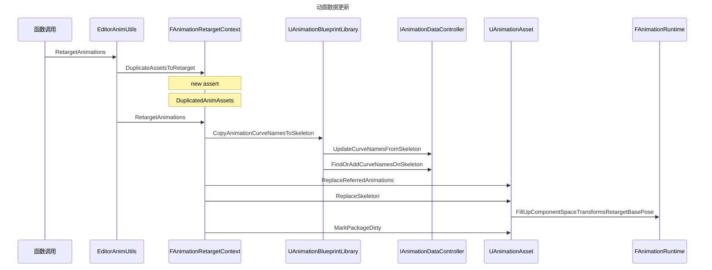
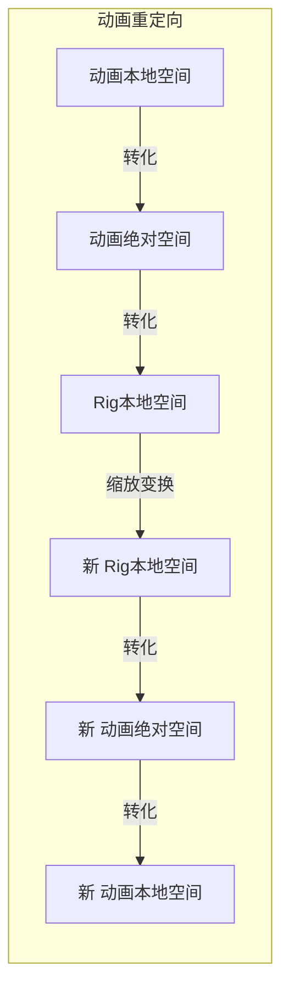

# 模型

## 骨骼

用于管理驱动骨架网格体和动画的骨骼

### 骨骼树

骨骼名和骨骼层级关系

### 空间坐标

旋转 缩放 位置

## 姿势

## 网格体

绑定顶点和骨骼的关系

### 顶点组

### 材质

### 蒙皮权重

# 动画

## 精灵动画

2D纹理动画

## 顶点动画

表情动画，记录各个顶点的坐标

## 插值动画

静态姿势插值

## 骨骼动画

蒙皮动画

可在骨架网格体上播放的单个动画资源。这些序列包含各个关键帧，而关键帧又规定了骨骼在特定时间点的位置、旋转和比例

绝对坐标动画 和 叠加坐标动画 相对叠加动画

每个顶点最多绑定4个关节

- 骨骼动画数据作用于不同大小的骨骼
  - 动作会变形吗
  - 如何保证不变形

# UE4动画

## 播放动画

[UE4动画源码](https://zhuanlan.zhihu.com/p/405437842)



## 动画状态更新

[动画系统](https://zhuanlan.zhihu.com/p/405437842)


- USkeletalMeshComponent 
  - 动画组件
- UAnimInstance
  - 动画实例、C++版的动画蓝图
- FAnimNode_Base
  - 相当于动画蓝图的动画节点
- FAnimInstanceProxy
  - 动画蓝图代理，可用于多线程



## 动画数据更新




## 骨骼渲染




## 动画重定向

### 时序


ContentBrowser.AssetContextMenu

FAssetContextMenu::RegisterContextMenu

FAssetTypeActions_AnimationAsset::FillRetargetMenu

SAnimationRemapSkeleton::ShowWindow



### 骨骼重定向

### 动画骨骼缩减

- 从骨骼系统A 缩减到骨骼系统B
  - 保持动画效果基本不变
  - 骨骼之间需要连接成树
    - 不同树之间的骨骼无法控制
    - 可能出现奇奇怪怪的动作表现
  - 被缩减的骨骼的动作将会被丢弃
- 约束信息
  - 维持父子关系

### 动画系统替换


### 获取静态姿势骨骼数据

$$
\begin{array}{ll}
SpaceBases = 静态姿势数据 \\
Position = SpaceBases.Position\\
Parent_{Pos} = bone.Constraint_{Pos}.Parent\\
Parent_{Rot} = bone.Constraint_{Rot}.Parent\\
Rig_{static}(bone \in Rig) = 
\left\{\begin{array}{ll}
    Space_{Com} = SpaceBases \\
    Space_{Loc} =
    \left\{\begin{array}{ll}
        SpaceBases  & other\\
       	GetRelative( SpaceBases ,  SpaceBases_{Parent_{Rot}}) & Parent_{Rot}\in Anim
   \end{array}\right.\\
   Position_{Loc} =
    \left\{\begin{array}{ll}
        Position  & other\\
        Position - Position_{Parent_{Pos}} & Parent_{Pos}\in Anim
   \end{array}\right.
\end{array}\right.
\end{array}
$$


```c++
FillUpTransformBasedOnRig(NewSkeleton, NewSpaceBases, NewRotations, NewTranslations, NewTranslationParentFlags);
FillUpTransformBasedOnRig(OldSkeleton, OldSpaceBases, OldRotations, OldTranslations, OldTranslationParentFlags);
void FillUpTransformBasedOnRig(USkeleton* Skeleton, TArray<FTransform>& NodeSpaceBases, TArray<FTransform> &Rotations, TArray<FVector>& Translations, TArray<bool>& TranslationParentFlagis)
{
	TArray<FTransform> SpaceBases;
    //静态姿势数据
	FAnimationRuntime::FillUpComponentSpaceTransformsRetargetBasePose(Skeleton, SpaceBases);
	const URig* Rig = Skeleton->GetRig();
    if(!Rig)return;
    for (int32 Index = 0; Index < Rig.NodeNum; ++Index)
	{
        //查找 Skeleton 上 Rig 对应的骨骼
        int32& BoneIndex = FindMeshBoneIndexFromBoneName(Skeleton, Skeleton->GetRigBoneMapping(Rig->GetNodeName(Index)));
        
        // 复制Rig 对应的  原骨架数据到新骨架
        NodeSpaceBases[Index] = SpaceBases[BoneIndex];
        Rotations[Index] = SpaceBases[BoneIndex];
        Translations[Index] = SpaceBases[BoneIndex].GetLocation();
        
        
		//获取骨骼约束信息 和父节点相关
		const FTransformBase* TransformBase = Rig->GetTransformBaseByNodeName(NodeName);
        // orientation constraint 方向约束	
        Rotations[Index] = SpaceBases[BoneIndex].GetRelativeTransform(SpaceBases[ParentBoneIndex]);

        // translation constraint 平移约束
         Translations[Index] = SpaceBases[BoneIndex].GetLocation() - SpaceBases[ParentBoneIndex].GetLocation();
         TranslationParentFlags[Index] = true;
       }
}

```

### 计算基础姿势骨骼相关性

$$
\begin{array}{ll}
Parent_{Pos} = bone.Constraint_{Pos}.Parent\\
Rel(bone \in Rig) = 
\left\{\begin{array}{ll}
    RelativeToNewSpace = ClearTranslation(GetRelative(Space^{Old}_{Com} , Space^{New}_{Com})) \\
    OldToNewLocScale =
    \left\{\begin{array}{ll}
        1  & Parent_{Pos}\notin Anim &  or  & LocLocation_{Old} = 0\\
        Position^{New}_{Loc} / Position^{Old}_{Loc}& Parent_{Pos}\in Anim
   \end{array}\right.
\end{array}\right.
\end{array}
$$


```c++
const TArray<FNode>& Nodes = Rig->GetNodes();
// calculate the relative transform to new skeleton so that we can apply the delta in component space
for (int32 NodeIndex = 0; NodeIndex < NumNodes; ++NodeIndex)
{
    RelativeToNewSpaceBases[NodeIndex] = NewSpaceBases[NodeIndex].GetRelativeTransform(OldSpaceBases[NodeIndex]); 

    // also savees the translation difference between old to new
    FVector OldTranslation = OldTranslations[NodeIndex];
    FVector NewTranslation = NewTranslations[NodeIndex];

    // skip root because we don't really have clear relative point to test with it
    if (NodeIndex != 0 && NewTranslationParentFlags[NodeIndex] == OldTranslationParentFlags[NodeIndex])
    {
        // only do this if parent status matches, otherwise, you'll have invalid state 
        // where one is based on shoulder, where the other is missing the shoulder node
        float OldTranslationSize = OldTranslation.Size();
        float NewTranslationSize = NewTranslation.Size();

        OldToNewTranslationRatio[NodeIndex] = (FMath::IsNearlyZero(OldTranslationSize)) ? 1.f/*do not touch new translation size*/ : NewTranslationSize / OldTranslationSize;
    }
    else
    {
        OldToNewTranslationRatio[NodeIndex] = 1.f; // set to be 1, we don't know what it is
    }
}
```

### 计算Rig骨骼数据

$$
\begin{array}{ll}
Tracks = Anim.Tracks_{Com}\\
Transform = Tracks.Transform\\
Parent_{Pos} = bone.Constraint_{Pos}.Parent\\
Parent_{Rot} = bone.Constraint_{Rot}.Parent\\
RigAnim.Tracks_{Loc}(bone \in Rig) = 
\left\{\begin{array}{ll}
   Pos =
   \left\{\begin{array}{ll}
       Tracks.Position  & Parent_{Pos}\notin Anim\\
       GetRelative(Transform , Transform_{Parent_{Pos}}).Position & other
   \end{array}\right.\\
   Rot =
   \left\{\begin{array}{ll}
       Tracks.Rotation  & Parent_{Rot}\notin Anim\\
       GetRelative(Transform , Transform_{Parent_{Rot}}).Rotation & other
   \end{array}\right.\\
   Scale = 
   \left\{\begin{array}{ll}
       Tracks.Scale & Parent_{Rot}\notin Anim\\
       GetRelative(Transform , Transform_{Parent_{Rot}}).Scale & other
   \end{array}\right.\\
\end{array}\right.
\end{array}
$$


```c++
bool UAnimSequence::ConvertAnimationDataToRiggingData(FAnimSequenceTrackContainer& RiggingAnimationData)
{
		const URig* Rig = MySkeleton->GetRig();
		TArray<FName> ValidNodeNames;
		int32 NumNodes = MySkeleton->GetMappedValidNodes(ValidNodeNames);//新骨骼数 
		TArray< TArray<FTransform> > AnimationDataInComponentSpace;//原动画数据
		int32 NumBones = GetSpaceBasedAnimationData(AnimationDataInComponentSpace, NULL);//原骨骼数
		const int32 NumModelKeys = DataModel->GetNumberOfKeys(); //动画帧数
		//初始化rig骨骼数据
		RiggingAnimationData.Initialize(ValidNodeNames);

		// first we copy all space bases back to it
		for (int32 NodeIndex = 0; NodeIndex < NumNodes; ++NodeIndex)
		{
			struct FRawAnimSequenceTrack& Track = RiggingAnimationData.AnimationTracks[NodeIndex];
            //rig骨骼 和 在原骨骼的序号
			const FName& NodeName = ValidNodeNames[NodeIndex];
			const int32& BoneIndex = MySkeleton->GetReferenceSkeleton().FindBoneIndex(MySkeleton->GetRigBoneMapping(NodeName));
			//计算约束
			int32 RigConstraintIndex = Rig->FindTransformBaseByNodeName(NodeName);
			const auto* RigConstraint = Rig->GetTransformBase(RigConstraintIndex);
			// 朝向约束
			const TArray<FRigTransformConstraint>& RotationTransformConstraint = RigConstraint->Constraints[EControlConstraint::Type::Orientation].TransformConstraints;
            if(RotationTransformConstraint.Num()>0){
                //rig 父骨骼 和 在原骨骼的序号
                const FName& ParentSpace = RotationTransformConstraint[0].ParentSpace;
                const int32& ParentBoneIndex = MySkeleton->GetReferenceSkeleton().FindBoneIndex(ParentBoneName = MySkeleton->GetRigBoneMapping(ParentSpace));
                //本地空间
                for (int32 KeyIndex = 0; KeyIndex < NumModelKeys; ++KeyIndex)
                {
                    FTransform ParentTransform = AnimationDataInComponentSpace[ParentBoneIndex][KeyIndex];
                    FTransform RelativeTransform = AnimationDataInComponentSpace[BoneIndex][KeyIndex].GetRelativeTransform(ParentTransform);
                    Track.RotKeys[KeyIndex] = RelativeTransform.GetRotation();
           		}
            }else{
                // 绝对空间
                for (int32 KeyIndex = 0; KeyIndex < NumModelKeys; ++KeyIndex)
                {
                    Track.RotKeys[KeyIndex] = AnimationDataInComponentSpace[BoneIndex][KeyIndex].GetRotation();
                }
            }
            //位置约束同理
			if (TranslationTransformConstraint.Num() > 0){
                // if no rig control, component space is used
                for (int32 KeyIndex = 0; KeyIndex < NumModelKeys; ++KeyIndex)
                {
                    FTransform ParentTransform = AnimationDataInComponentSpace[ParentBoneIndex][KeyIndex];
                    FTransform RelativeTransform = AnimationDataInComponentSpace[BoneIndex][KeyIndex].GetRelativeTransform(ParentTransform);
                    Track.PosKeys[KeyIndex] = RelativeTransform.GetTranslation();
                    Track.ScaleKeys[KeyIndex] = RelativeTransform.GetScale3D();
                }
            }else{
                for (int32 KeyIndex = 0; KeyIndex < NumModelKeys; ++KeyIndex)
                {
                    Track.PosKeys[KeyIndex] = AnimationDataInComponentSpace[BoneIndex][KeyIndex].GetTranslation();
                    Track.ScaleKeys[KeyIndex] = AnimationDataInComponentSpace[BoneIndex][KeyIndex].GetScale3D();
                }
            }
        }
	return true;
}

```

### 计算不同空间下骨骼数据

$$
\begin{array}{ll}
Tracks = Rig.Tracks_{Loc}\\
STracks = ScaleTranslation(Tracks,OldToNewLocScale)\\
Parent_{Pos} = bone.Constraint_{Pos}.Parent\\
Parent_{Rot} = bone.Constraint_{Rot}.Parent\\
ComAnimations(bone \in Rig) = 
\left\{\begin{array}{ll}
   Position =
   \left\{\begin{array}{ll}
       STracks.Position  & Parent_{Pos}\notin Anim\\
       (STracks * Tracks_{Parent_{Pos}}).Position & other
   \end{array}\right.\\
   Rotation =
   \left\{\begin{array}{ll}
       STracks.Rotation  & Parent_{Rot}\notin Anim\\
       (STracks * Tracks_{Parent_{Rot}}).Rotation & other
   \end{array}\right.\\
   Scale = 
   \left\{\begin{array}{ll}
       STracks.Scale  & Parent_{Rot}\notin Anim\\
       (STracks * Tracks_{Parent_{Rot}}).Scale & other
   \end{array}\right.\\
\end{array}\right.\\
CTracks = RelativeToNewSpace * ComAnimations\\
RigAnim.Tracks_{Loc}(bone \in Rig) = 
\left\{\begin{array}{ll}
   Pos =
   \left\{\begin{array}{ll}
       CTracks.Rotation  & Parent_{Pos}\notin Anim\\
       Inverse(CTracks_Parent_{Pos}.Rotation) * CTracks.Rotation  & other
   \end{array}\right.\\
   Rot =
   \left\{\begin{array}{ll}
       CTracks.Rotation  & Parent_{Rot}\notin Anim\\
       GetRelative(CTracks , CTracks_Parent_{Rot}).Rotation  & other
   \end{array}\right.\\
   Scale = 
   \left\{\begin{array}{ll}
       CTracks.Rotation  & Parent_{Rot}\notin Anim\\
       GetRelative(CTracks , CTracks_Parent_{Rot}).Scale  & other
   \end{array}\right.\\
\end{array}\right.
\end{array}
$$


```c++
//不同空间下的动画 -> 骨骼 -> 对应的骨骼帧数据
TArray< TArray<FTransform> > ComponentSpaceAnimations, ConvertedLocalSpaceAnimations, ConvertedSpaceAnimations;
//动画帧数
const int32 NumKeys = DataModel->GetNumberOfKeys();
for (int32 SrcTrackIndex=0; SrcTrackIndex<SrcNumTracks; ++SrcTrackIndex)		
{
    //当前骨骼index 和 骨骼动画数据
    int32 NodeIndex = Rig->FindNode(SrcValidNodeNames[SrcTrackIndex]);
    auto& RawAnimation = RiggingAnimationData.AnimationTracks[SrcTrackIndex];

    // 约束里的父骨骼节点 index
    int32 RotParentTrackIndex = FindValidTransformParentTrack(Rig, NodeIndex, false, SrcValidNodeNames);
    int32 TransParentTrackIndex = FindValidTransformParentTrack(Rig, NodeIndex, true, SrcValidNodeNames);
    // fill up keys - calculate PK1 * K1
    for(int32 Key=0; Key<NumKeys; ++Key)
    {
        FTransform AnimatedLocalKey;
        //计算关键帧 并且混合关键帧得到中间帧数据  AnimatedLocalKey
        // ?函数代码逻辑有一些迷惑 并且竟然还不能调试？
        FAnimationUtils::ExtractTransformFromTrack(time, NumKeys, GetPlayLength(), RiggingAnimationData.AnimationTracks[SrcTrackIndex], Interpolation, AnimatedLocalKey);
		//应用姿势相关性作变换，以适应不同比例的骨骼
        AnimatedLocalKey.ScaleTranslation(OldToNewTranslationRatio[NodeIndex]);
        if(RotParentTrackIndex != INDEX_NONE)
        {
            //从本地空间到绝对空间 和 上面 Rig 动画的定义相对
            FQuat ComponentSpaceRotation = ComponentSpaceAnimations[RotParentTrackIndex][Key].GetRotation() * AnimatedLocalKey.GetRotation();
            ComponentSpaceAnimations[SrcTrackIndex][Key].SetRotation(ComponentSpaceRotation);
        }
        else
        {
            ComponentSpaceAnimations[SrcTrackIndex][Key].SetRotation(AnimatedLocalKey.GetRotation());
        }

        if (TransParentTrackIndex != INDEX_NONE)
        {
            //从本地空间到绝对空间
            FVector ComponentSpaceTranslation = ComponentSpaceAnimations[TransParentTrackIndex][Key].TransformPosition(AnimatedLocalKey.GetTranslation());
            ComponentSpaceAnimations[SrcTrackIndex][Key].SetTranslation(ComponentSpaceTranslation);
            FVector ParentComponentSpaceScale3D = ComponentSpaceAnimations[TransParentTrackIndex][Key].GetScale3D();
            ComponentSpaceAnimations[SrcTrackIndex][Key].SetScale3D(ParentComponentSpaceScale3D * AnimatedLocalKey.GetScale3D());
        }
        else
        {
            ComponentSpaceAnimations[SrcTrackIndex][Key].SetTranslation(AnimatedLocalKey.GetTranslation());
            ComponentSpaceAnimations[SrcTrackIndex][Key].SetScale3D(AnimatedLocalKey.GetScale3D());
        }
    }
}

TArray<struct FRawAnimSequenceTrack> NewRawAnimationData = RiggingAnimationData.AnimationTracks;
for (int32 SrcTrackIndex=0; SrcTrackIndex<SrcNumTracks; ++SrcTrackIndex)
{
    int32 NodeIndex = Rig->FindNode(SrcValidNodeNames[SrcTrackIndex]);
    // find rotation parent node
    int32 RotParentTrackIndex = FindValidTransformParentTrack(Rig, NodeIndex, false, SrcValidNodeNames);
    int32 TransParentTrackIndex = FindValidTransformParentTrack(Rig, NodeIndex, true, SrcValidNodeNames);

    // clear translation;
    RelativeToNewSpaceBases[NodeIndex].SetTranslation(FVector::ZeroVector);

    for(int32 Key=0; Key<NumKeys; ++Key)
    {
        // now convert to the new space and save to local spaces
        ConvertedSpaceAnimations[SrcTrackIndex][Key] = RelativeToNewSpaceBases[NodeIndex] * ComponentSpaceAnimations[SrcTrackIndex][Key];

        if(RotParentTrackIndex != INDEX_NONE)
        {
            FQuat LocalRotation = ConvertedSpaceAnimations[RotParentTrackIndex][Key].GetRotation().Inverse() * ConvertedSpaceAnimations[SrcTrackIndex][Key].GetRotation();
            ConvertedLocalSpaceAnimations[SrcTrackIndex][Key].SetRotation(LocalRotation);
        }
        else
        {
            ConvertedLocalSpaceAnimations[SrcTrackIndex][Key].SetRotation(ConvertedSpaceAnimations[SrcTrackIndex][Key].GetRotation());
        }

        if(TransParentTrackIndex != INDEX_NONE)
        {
            FTransform LocalTransform = ConvertedSpaceAnimations[SrcTrackIndex][Key].GetRelativeTransform(ConvertedSpaceAnimations[TransParentTrackIndex][Key]);
            ConvertedLocalSpaceAnimations[SrcTrackIndex][Key].SetTranslation(LocalTransform.GetLocation());
            ConvertedLocalSpaceAnimations[SrcTrackIndex][Key].SetScale3D(LocalTransform.GetScale3D());
        }
        else
        {
            ConvertedLocalSpaceAnimations[SrcTrackIndex][Key].SetTranslation(ConvertedSpaceAnimations[SrcTrackIndex][Key].GetTranslation());
            ConvertedLocalSpaceAnimations[SrcTrackIndex][Key].SetScale3D(ConvertedSpaceAnimations[SrcTrackIndex][Key].GetScale3D());
        }
    }

    auto& RawAnimation = NewRawAnimationData[SrcTrackIndex];
    for(int32 Key=0; Key<NumKeys; ++Key)
    {
        RawAnimation.PosKeys[Key] = ConvertedLocalSpaceAnimations[SrcTrackIndex][Key].GetLocation();
        RawAnimation.RotKeys[Key] = ConvertedLocalSpaceAnimations[SrcTrackIndex][Key].GetRotation();
        RawAnimation.ScaleKeys[Key] = ConvertedLocalSpaceAnimations[SrcTrackIndex][Key].GetScale3D();

        // normalize rotation
        RawAnimation.RotKeys[Key].Normalize();
    }
}
RiggingAnimationData.AnimationTracks = MoveTemp(NewRawAnimationData);
RiggingAnimationData.TrackNames = MoveTemp(SrcValidNodeNames);
```

### 转化骨骼数据为动画数据

$$
\begin{array}{ll}
Tracks = RigAnim.Tracks_{Com}\\
Parent_{Pos} = bone.Constraint_{Pos}.Parent\\
Parent_{Rot} = bone.Constraint_{Rot}.Parent\\
Anim.Tracks_{Loc}(bone \in Rig) = 
\left\{\begin{array}{ll}
   Pos =
   \left\{\begin{array}{ll}
       Tracks.Position  & Parent_{Pos}\notin Anim\\
       GetRelative(Transform , Transform_{Parent_{Pos}}).Position & other
   \end{array}\right.\\
   Rot =
   \left\{\begin{array}{ll}
       Tracks.Rotation  & Parent_{Rot}\notin Anim\\
       GetRelative(Transform , Transform_{Parent_{Rot}}).Rotation & other
   \end{array}\right.\\
   Scale = 
   \left\{\begin{array}{ll}
       Tracks.Scale & Parent_{Rot}\notin Anim\\
       GetRelative(Transform , Transform_{Parent_{Rot}}).Scale & other
   \end{array}\right.\\
\end{array}\right.
\end{array}
$$


```c++
bool UAnimSequence::ConvertRiggingDataToAnimationData(FAnimSequenceTrackContainer& RiggingAnimationData)
{
    TArray< TArray<FTransform> > AnimationDataInComponentSpace;
    //获取所有骨骼静态数据 ， 并用 rig 数据替换同名骨骼数据
    int32 NumBones = GetSpaceBasedAnimationData(AnimationDataInComponentSpace, &RiggingAnimationData);

	USkeleton* MySkeleton = GetSkeleton();
	TArray<FName> ValidNodeNames;
	MySkeleton->GetMappedValidNodes(ValidNodeNames);
    // remove from ValidNodeNames if it doesn't belong to AnimationTrackNames
    for (int32 NameIndex=0; NameIndex<ValidNodeNames.Num(); ++NameIndex)
    {
        if (RiggingAnimationData.TrackNames.Contains(ValidNodeNames[NameIndex]) == false)
        {
            ValidNodeNames.RemoveAt(NameIndex);
            --NameIndex;
        }
    }

	int32 ValidNumNodes = ValidNodeNames.Num();

    // get local spaces
    // add all tracks?
    Controller->RemoveAllBoneTracks();

    const int32 NumModelKeys = DataModel->GetNumberOfKeys();
    const FReferenceSkeleton& RefSkeleton = MySkeleton->GetReferenceSkeleton();
    const URig* Rig = MySkeleton->GetRig();
    for (int32 NodeIndex = 0; NodeIndex < ValidNumNodes; ++NodeIndex)
    {
        FName BoneName = MySkeleton->GetRigBoneMapping(ValidNodeNames[NodeIndex]);
        int32 BoneIndex = RefSkeleton.FindBoneIndex(BoneName);

        // Add a new track by name
        Controller->AddBoneTrack(BoneName);
        const int32& ParentBoneIndex = RefSkeleton.GetParentIndex(BoneIndex);
        if(ParentBoneIndex != INDEX_NONE)
        {
            for(int32 KeyIndex = 0; KeyIndex < NumModelKeys; ++KeyIndex)
            {
                const FTransform LocalTransform = AnimationDataInComponentSpace[BoneIndex][KeyIndex].GetRelativeTransform(AnimationDataInComponentSpace[ParentBoneIndex][KeyIndex]);

                PosKeys[KeyIndex] = LocalTransform.GetTranslation();
                RotKeys[KeyIndex] = LocalTransform.GetRotation();
                ScaleKeys[KeyIndex] = LocalTransform.GetScale3D();
            }
        }
        else
        {
            for(int32 KeyIndex = 0; KeyIndex < NumModelKeys; ++KeyIndex)
            {
                const FTransform LocalTransform = AnimationDataInComponentSpace[BoneIndex][KeyIndex];

                PosKeys[KeyIndex] = LocalTransform.GetTranslation();
                RotKeys[KeyIndex] = LocalTransform.GetRotation();
                ScaleKeys[KeyIndex] = LocalTransform.GetScale3D();
            }
        }
        // Set the track's key data
        Controller->SetBoneTrackKeys(BoneName, PosKeys, RotKeys, ScaleKeys);
    }
	return false;
}

```

### 总结




## 骨骼动画压缩 

宵宫_大喜 数据

- 动画数据字符流 4274892 bytes
  - 骨骼帧数据
    - 骨骼对应的关键帧数
    - 骨骼空间坐标
- 动画骨骼 364 + Root骨骼
- 骨骼帧在数据字符流的位置映射 * 730
  - CompressedTrackOffsets

# 动画蒙太奇

# 射线检测

## 射线类型

```c++
(前缀：Multi) + 射线形状 + [后缀：ForObjects|ByChannel|ByProfile];
```

### 前缀 

- Multi ：检测多个 对象 
- 检测第一个对象

### 形状

一条激光，一个球形，一个立方体或者一个胶囊体

### 检测对象 后缀

 后缀：`ForObjects`意味着这个射线的检测对象为一个类及其子类对象，比如我们想用这条射线探测各种各样的宝箱；


 后缀：`ByChannel`是对被检测对象分类的另一种方法，我们可以在**Project Settings/Collision/Trace Channels** 中添加**Channel**，并且把一个射线指定到某一**Channel**，然后在各种物体设置对这个**Channel**射线的响应方式：忽略（Ignore）、重叠(Overlap)抑或是阻挡(Block)。

后缀：`ByProfile`，前两种后缀都是从被检测对象的角度来定义射线的，有时候，比如我们有一个角色，并且已经设置完这个角色和各种环境对象的响应方式，我们想定义一个射线让它的响应方式完全照搬于角色，这时，我们就可以在**Project Settings/Collision/Preset** 中添加一个**Profile预设**，并把这个预设设为和角色相应属性相同就可以了。

## 射线返回值

- **Return Value：** 布尔类型，是否发生了碰撞。
- **Out Hit：** 结构体类型的碰撞结果，展开以后如下：
