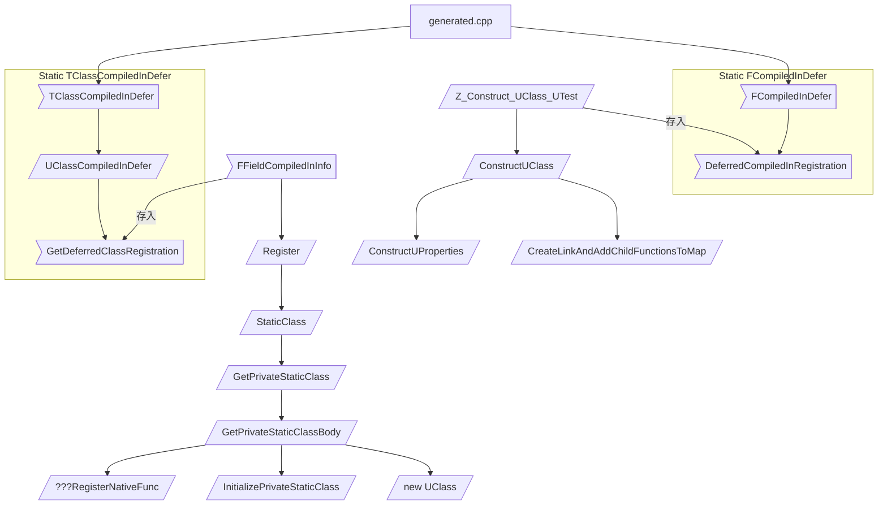
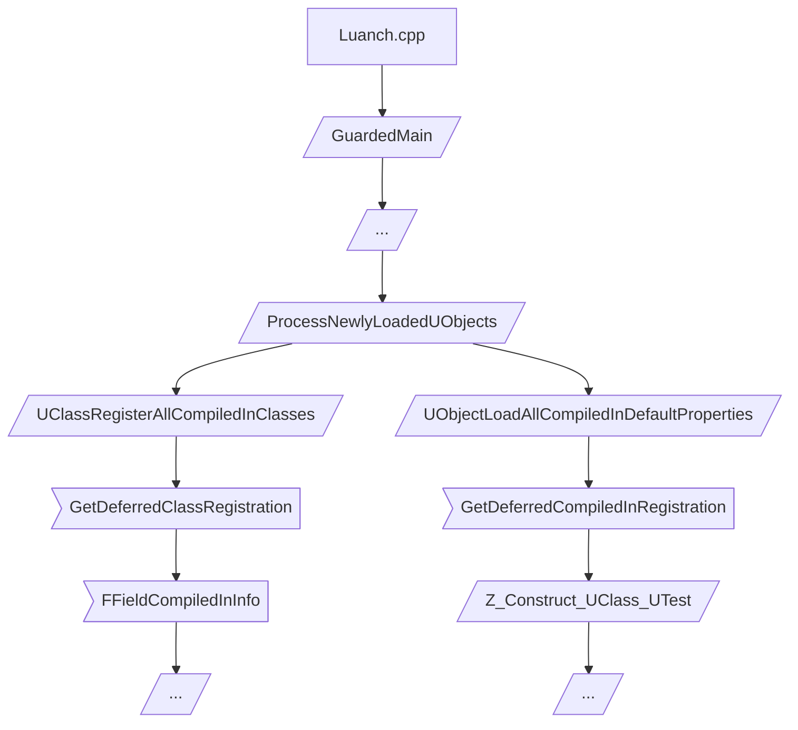

# 前言

## 什么是反射

- 反射是程序可以访问、检测和修改它本身状态或行为的一种能力

### UClass

#### 功能

- 通过类型获取类对象
- 通过函数名调用成员函数
- 通过属性名获取属性
- 通过对象获取类型信息

####  语法

- 类型名参数仅能用于宏

#### 内存结构

- 保存构造函数
- 保存属性名和属性偏移地址
- 保存函数名和函数指针

## UE4反射

### UProperty 

- 属性的序列化和反序列化

### UFunction

- 蓝图继承和调用函数
- 

# 反射机制
GENERATED_UCLASS_BODY()：属于之前版本的宏，自动生成带有指定参数的构造函数，不用用户再去生明构造函数，需要在CPP中实现，否则报错，之后成员是public。

GENERATED_BODY()：属于新版本的宏，不生成构造函数，如果需要自定义，需要自己声明并定义，之后成员是private。

总结：使用后者，不要使用前者。

## 宏

### GENERATED_BODY()
- 如果没有声明一个无参构造函数, 自动声明定义一个带FObjectInitializer参数的构造函数

- 如果有声明无参构造函数, 不做任何处理

- ```c++
  GENERATED_BODY();
  
  // #define GENERATED_BODY(...) BODY_MACRO_COMBINE(CURRENT_FILE_ID,_,__LINE__,_GENERATED_BODY);
  BODY_MACRO_COMBINE(CURRENT_FILE_ID,_,__LINE__,_GENERATED_BODY);
  
  // #define BODY_MACRO_COMBINE(A,B,C,D) BODY_MACRO_COMBINE_INNER(A,B,C,D)
  BODY_MACRO_COMBINE_INNER(CURRENT_FILE_ID,_,__LINE__,_GENERATED_BODY);
  
  // #define BODY_MACRO_COMBINE_INNER(A,B,C,D) A##B##C##D
  CURRENT_FILE_ID##_##__LINE__##_GENERATED_BODY
//
  ```

### GENERATED_UCLASS_BODY()

- ```c++
    GENERATED_UCLASS_BODY();
    
    //#define GENERATED_UCLASS_BODY(...) GENERATED_BODY_LEGACY()
    GENERATED_BODY_LEGACY();
    
    //#define GENERATED_BODY_LEGACY(...) BODY_MACRO_COMBINE(CURRENT_FILE_ID,_,__LINE__,_GENERATED_BODY_LEGACY);
    BODY_MACRO_COMBINE(CURRENT_FILE_ID,_,__LINE__,_GENERATED_BODY_LEGACY);
    
    //#define BODY_MACRO_COMBINE(A,B,C,D) BODY_MACRO_COMBINE_INNER(A,B,C,D)
    BODY_MACRO_COMBINE_INNER(CURRENT_FILE_ID,_,__LINE__,_GENERATED_BODY_LEGACY);
    
    // #define BODY_MACRO_COMBINE_INNER(A,B,C,D) A##B##C##D
    CURRENT_FILE_ID##_##__LINE__##_GENERATED_BODY_LEGACY
    ```

### CURRENT_FILE_ID_LINE_GENERATED_BODY

- ```c++
  PRAGMA_DISABLE_DEPRECATION_WARNINGS \  // 可忽略
  public: \
  	ZWorld_Source_ZWorld_Test_h_13_PRIVATE_PROPERTY_OFFSET \ //空值
  	ZWorld_Source_ZWorld_Test_h_13_SPARSE_DATA \  //空值
  	ZWorld_Source_ZWorld_Test_h_13_RPC_WRAPPERS_NO_PURE_DECLS \ //空值
      ZWorld_Source_ZWorld_Test_h_13_CALLBACK_WRAPPERS \ 
  	ZWorld_Source_ZWorld_Test_h_13_INCLASS_NO_PURE_DECLS \
  	ZWorld_Source_ZWorld_Test_h_13_ENHANCED_CONSTRUCTORS \
  private: \
  PRAGMA_ENABLE_DEPRECATION_WARNINGS  // 可忽略
  ```
```
  
- ```c++
  public: \
      virtual void FTestNative_Implementation(); \
      static void execFTestNative( UObject* Context, FFrame& Stack, RESULT_DECL )
      static void execFBlueprintCallable( UObject* Context, FFrame& Stack, RESULT_DECL )
  private: \
  	static void StaticRegisterNativesUTest(); \
  	friend struct Z_Construct_UClass_UTest_Statics; \
  public: \
  	DECLARE_CLASS(UTest, UObject, COMPILED_IN_FLAGS(0), CASTCLASS_None, TEXT("/Script/ZWorld"), NO_API) \
  	DECLARE_SERIALIZER(UTest)
      
  private: \
  	/** Private move- and copy-constructors, should never be used */ \
      // 将拷贝和移动构造函数私有化, 阻止调用, 防止误操作.
  	NO_API UTest(UTest&&); \
  	NO_API UTest(const UTest&); \
  public: \
  	//DECLARE_VTABLE_PTR_HELPER_CTOR(NO_API, UTest); \
      /** DO NOT USE. This constructor is for internal usage only for hot-reload purposes. */ \
  	NO_API UTest(FVTableHelper& Helper);
  
  	//DEFINE_VTABLE_PTR_HELPER_CTOR_CALLER(UTest); \
  	static UObject* __VTableCtorCaller(FVTableHelper& Helper) \
  	{ \
  		return new (EC_InternalUseOnlyConstructor, (UObject*)GetTransientPackage(), NAME_None, RF_NeedLoad | RF_ClassDefaultObject | RF_TagGarbageTemp) UTest(Helper); \
  	}
  
  	//DEFINE_DEFAULT_CONSTRUCTOR_CALL(UTest)
  	static void __DefaultConstructor(const FObjectInitializer& X) { new((EInternal*)X.GetObj())UTest; }
  private: \
```

### CURRENT_FILE_ID_LINE_GENERATED_BODY_LEGACY

- ```c++
  PRAGMA_DISABLE_DEPRECATION_WARNINGS \  // 可忽略
  public: \
  	ZWorld_Source_ZWorld_Test_h_13_PRIVATE_PROPERTY_OFFSET \ //空值
  	ZWorld_Source_ZWorld_Test_h_13_SPARSE_DATA \  //空值
  	ZWorld_Source_ZWorld_Test_h_13_RPC_WRAPPERS \ 
      ZWorld_Source_ZWorld_Test_h_13_CALLBACK_WRAPPERS \ //空值
  	ZWorld_Source_ZWorld_Test_h_13_INCLASS \
  	ZWorld_Source_ZWorld_Test_h_13_STANDARD_CONSTRUCTORS \
  private: \
  PRAGMA_ENABLE_DEPRECATION_WARNINGS  // 可忽略
  ```
```
  
- ```c++
    public: \
    	virtual void FTestNative_Implementation(); \
        static void execFTestNative( UObject* Context, FFrame& Stack, RESULT_DECL )
        static void execFBlueprintCallable( UObject* Context, FFrame& Stack, RESULT_DECL )
        
    private: \
    	static void StaticRegisterNativesUTest(); \
    	friend struct Z_Construct_UClass_UTest_Statics; \
    public: \
    	DECLARE_CLASS(UTest, UObject, COMPILED_IN_FLAGS(0), CASTCLASS_None, TEXT("/Script/ZWorld"), NO_API) \
    	DECLARE_SERIALIZER(UTest)
    
        	/** Standard constructor, called after all reflected properties have been initialized */ \
    	NO_API UTest(const FObjectInitializer& ObjectInitializer); \
    	//DEFINE_DEFAULT_OBJECT_INITIALIZER_CONSTRUCTOR_CALL(UTest) \
        static void __DefaultConstructor(const FObjectInitializer& X) { new((EInternal*)X.GetObj())UTest(X); }
    
    	//DECLARE_VTABLE_PTR_HELPER_CTOR(NO_API, UTest); \
    	/** DO NOT USE. This constructor is for internal usage only for hot-reload purposes. */ \
    	NO_API UTest(FVTableHelper& Helper);
    	//DEFINE_VTABLE_PTR_HELPER_CTOR_CALLER(UTest); \
    	static UObject* __VTableCtorCaller(FVTableHelper& Helper) \
    	{ \
    		return new (EC_InternalUseOnlyConstructor, (UObject*)GetTransientPackage(), NAME_None, RF_NeedLoad | RF_ClassDefaultObject | RF_TagGarbageTemp) UTest(Helper); \
    	}
    
    private: \
    	/** Private move- and copy-constructors, should never be used */ \
        // 将拷贝和移动构造函数私有化, 阻止调用, 防止误操作.
    	NO_API UTest(UTest&&); \
    	NO_API UTest(const UTest&); \
    public:
    
```

### DECLARE_CLASS

- ```C++
  DECLARE_CLASS(UTest, UObject, COMPILED_IN_FLAGS(0), CASTCLASS_None, TEXT("/Script/ZWorld"), NO_API) \
  //#define DECLARE_CLASS( TClass, TSuperClass, TStaticFlags, TStaticCastFlags, TPackage, TRequiredAPI  ) \
  private: \
      TClass& operator=(TClass&&);   \
      TClass& operator=(const TClass&);   \
  	TRequiredAPI static UClass* GetPrivateStaticClass(); \
  public: \
  	/** Bitwise union of #EClassFlags pertaining to this class.*/ \
  	enum {StaticClassFlags=TStaticFlags}; \
  	/** Typedef for the base class ({{ typedef-type }}) */ \
  	typedef TSuperClass Super;\
  	/** Typedef for {{ typedef-type }}. */ \
  	typedef TClass ThisClass;\
  	/** Returns a UClass object representing this class at runtime */ \
  	inline static UClass* StaticClass() \
  	{ \
  		return GetPrivateStaticClass(); \
  	} \
  	/** Returns the package this class belongs in */ \
  	inline static const TCHAR* StaticPackage() \
  	{ \
  		return TPackage; \
  	} \
  	/** Returns the static cast flags for this class */ \
  	inline static EClassCastFlags StaticClassCastFlags() \
  	{ \
  		return TStaticCastFlags; \
  	} \
  	/** For internal use only; use StaticConstructObject() to create new objects. */ \
  	inline void* operator new(const size_t InSize, EInternal InInternalOnly, UObject* InOuter = (UObject*)GetTransientPackage(), FName InName = NAME_None, EObjectFlags InSetFlags = RF_NoFlags) \
  	{ \
  		return StaticAllocateObject(StaticClass(), InOuter, InName, InSetFlags); \
  	} \
  	/** For internal use only; use StaticConstructObject() to create new objects. */ \
  	inline void* operator new( const size_t InSize, EInternal* InMem ) \
  	{ \
  		return (void*)InMem; \
  	} \
  	/* Eliminate V1062 warning from PVS-Studio while keeping MSVC and Clang happy. */ \
  	inline void operator delete(void* InMem) \
  	{ \
  		::operator delete(InMem); \
  	}
  
  ```

### DECLARE_SERIALIZER

- ```C++
  DECLARE_SERIALIZER(UTest);
  //#define DECLARE_SERIALIZER( TClass ) \
  friend FArchive &operator<<( FArchive& Ar, TClass*& Res ) \
  { \
      return Ar << (UObject*&)Res; \
  } \
  friend void operator<<(FStructuredArchive::FSlot InSlot, TClass*& Res) \
  { \
      InSlot << (UObject*&)Res; \
  }
  ```

### IMPLEMENT_CLASS

 - ```c++
   //IMPLEMENT_CLASS(UTest, 1605082161);
   //#define IMPLEMENT_CLASS(TClass, TClassCrc) \
   static TClassCompiledInDefer<TClass> AutoInitialize##TClass(TEXT(#TClass), sizeof(TClass), TClassCrc); \
       UClass* TClass::GetPrivateStaticClass() \
   { \
       static UClass* PrivateStaticClass = NULL; \
           if (!PrivateStaticClass) \
           { \
               /* this could be handled with templates, but we want it external to avoid code bloat */ \
               GetPrivateStaticClassBody( \
                                         StaticPackage(), \
                                         (TCHAR*)TEXT(#TClass) + 1 + ((StaticClassFlags & CLASS_Deprecated) ? 11 : 0), \
                                         PrivateStaticClass, \
                                         StaticRegisterNatives##TClass, \
                                         sizeof(TClass), \
                                         alignof(TClass), \
                                         (EClassFlags)TClass::StaticClassFlags, \
                                         TClass::StaticClassCastFlags(), \
                                         TClass::StaticConfigName(), \
                                         (UClass::ClassConstructorType)InternalConstructor<TClass>, \
                                         (UClass::ClassVTableHelperCtorCallerType)InternalVTableHelperCtorCaller<TClass>, \
                                         &TClass::AddReferencedObjects, \
                                         &TClass::Super::StaticClass, \
                                         &TClass::WithinClass::StaticClass \
                                        ); \
           } \
               return PrivateStaticClass; \
   }
   
   void GetPrivateStaticClassBody(
   const TCHAR* PackageName,
   	const TCHAR* Name,
   	UClass*& ReturnClass,
   	void(*RegisterNativeFunc)(),
   	uint32 InSize,
   	uint32 InAlignment,
   	EClassFlags InClassFlags,
   	EClassCastFlags InClassCastFlags,
   	const TCHAR* InConfigName,
   	UClass::ClassConstructorType InClassConstructor,
   	UClass::ClassVTableHelperCtorCallerType InClassVTableHelperCtorCaller,
   	UClass::ClassAddReferencedObjectsType InClassAddReferencedObjects,
   	UClass::StaticClassFunctionType InSuperClassFn,
   	UClass::StaticClassFunctionType InWithinClassFn,
   	bool bIsDynamic /*= false*/,
   	UDynamicClass::DynamicClassInitializerType InDynamicClassInitializerFn /*= nullptr*/
   	)
   {
   #if WITH_HOT_RELOAD
   	if (GIsHotReload)
   	{
   		check(!bIsDynamic);
   		UPackage* Package = FindPackage(NULL, PackageName);
   		if (Package)
   		{
   			ReturnClass = FindObject<UClass>((UObject *)Package, Name);
   			if (ReturnClass)
   			{
   				if (ReturnClass->HotReloadPrivateStaticClass(
   					InSize,
   					InClassFlags,
   					InClassCastFlags,
   					InConfigName,
   					InClassConstructor,
   					InClassVTableHelperCtorCaller,
   					InClassAddReferencedObjects,
   					InSuperClassFn(),
   					InWithinClassFn()
   					))
   				{
   					// Register the class's native functions.
   					RegisterNativeFunc();
   				}
   				return;
   			}
   			else
   			{
   				UE_LOG(LogClass, Log, TEXT("Could not find existing class %s in package %s for HotReload, assuming new class"), Name, PackageName);
   			}
   		}
   		else
   		{
   			UE_LOG(LogClass, Log, TEXT("Could not find existing package %s for HotReload of class %s, assuming a new package."), PackageName, Name);
   		}
   	}
   #endif
   
   	if (!bIsDynamic)
   	{
   		ReturnClass = (UClass*)GUObjectAllocator.AllocateUObject(sizeof(UClass), alignof(UClass), true);
   		ReturnClass = ::new (ReturnClass)
   			UClass
   			(
   			EC_StaticConstructor,
   			Name,
   			InSize,
   			InAlignment,
   			InClassFlags,
   			InClassCastFlags,
   			InConfigName,
   			EObjectFlags(RF_Public | RF_Standalone | RF_Transient | RF_MarkAsNative | RF_MarkAsRootSet),
   			InClassConstructor,
   			InClassVTableHelperCtorCaller,
   			InClassAddReferencedObjects
   			);
   		check(ReturnClass);
   	}
   	else
   	{
   		ReturnClass = (UClass*)GUObjectAllocator.AllocateUObject(sizeof(UDynamicClass), alignof(UDynamicClass), GIsInitialLoad);
   		ReturnClass = ::new (ReturnClass)
   			UDynamicClass
   			(
   			EC_StaticConstructor,
   			Name,
   			InSize,
   			InAlignment,
   			InClassFlags|CLASS_CompiledFromBlueprint,
   			InClassCastFlags,
   			InConfigName,
   			EObjectFlags(RF_Public | RF_Standalone | RF_Transient | RF_Dynamic | (GIsInitialLoad ? RF_MarkAsRootSet : RF_NoFlags)),
   			InClassConstructor,
   			InClassVTableHelperCtorCaller,
   			InClassAddReferencedObjects,
   			InDynamicClassInitializerFn
   			);
   		check(ReturnClass);
   	}
   	InitializePrivateStaticClass(
   		InSuperClassFn(),
   		ReturnClass,
   		InWithinClassFn(),
   		PackageName,
   		Name
   		);
   
   	// Register the class's native functions.
   	RegisterNativeFunc();
   }
   
   
   struct FCompiledInDefer
   {
   	FCompiledInDefer(class UClass *(*InRegister)(), class UClass *(*InStaticClass)(), const TCHAR* PackageName, const TCHAR* Name, bool bDynamic, const TCHAR* DynamicPackageName = nullptr, const TCHAR* DynamicPathName = nullptr, void (*InInitSearchableValues)(TMap<FName, FName>&) = nullptr)
   	{
   		if (bDynamic)
   		{
   			GetConvertedDynamicPackageNameToTypeName().Add(FName(DynamicPackageName), FName(Name));
   		}
   		UObjectCompiledInDefer(InRegister, InStaticClass, Name, PackageName, bDynamic, DynamicPathName, InInitSearchableValues);
   	}
   };
   ```


## 文件

### Test.h

```c++
UCLASS()
class ZWORLD_API UTest : public UObject
{
	GENERATED_BODY()
public:
	UTest();
	~UTest();

	int int_a = -1;
	bool bool_b = false;
	int fun() {
		UTest::StaticClass();
		return 0;
	}
	UPROPERTY(BlueprintReadWrite, Category = "C++")
	float PReadWrite;

	UPROPERTY(BlueprintReadOnly, Category = "C++")
	int PReadOnly;

	UFUNCTION(BlueprintCallable)
	void FBlueprintCallable();

	UFUNCTION(BlueprintImplementableEvent)
	void FBlueprintImplementableEvent();

	UFUNCTION(BlueprintNativeEvent)
	void FTestNative();
    // cpp void FTestNative_Implementation();
};

```


### generated.cpp

- ```c++
  void EmptyLinkFunctionForGeneratedCodeTest() {}
  // Cross Module References
  	ZWORLD_API UClass* Z_Construct_UClass_UTest_NoRegister();
  	ZWORLD_API UClass* Z_Construct_UClass_UTest();
  	COREUOBJECT_API UClass* Z_Construct_UClass_UObject();
  	UPackage* Z_Construct_UPackage__Script_ZWorld();
  // End Cross Module References
  	DEFINE_FUNCTION(UTest::execFTestNative)
  	{
  		P_FINISH;
  		P_NATIVE_BEGIN;
  		P_THIS->FTestNative_Implementation();
  		P_NATIVE_END;
  	}
  	DEFINE_FUNCTION(UTest::execFBlueprintCallable)
  	{
  		P_FINISH;
  		P_NATIVE_BEGIN;
  		P_THIS->FBlueprintCallable();
  		P_NATIVE_END;
  	}
  	static FName NAME_UTest_FBlueprintImplementableEvent = FName(TEXT("FBlueprintImplementableEvent"));
  	void UTest::FBlueprintImplementableEvent()
  	{
  		ProcessEvent(FindFunctionChecked(NAME_UTest_FBlueprintImplementableEvent),NULL);
  	}
  	static FName NAME_UTest_FTestNative = FName(TEXT("FTestNative"));
  	void UTest::FTestNative()
  	{
  		ProcessEvent(FindFunctionChecked(NAME_UTest_FTestNative),NULL);
  	}
  	void UTest::StaticRegisterNativesUTest()
  	{
  		UClass* Class = UTest::StaticClass();
  		static const FNameNativePtrPair Funcs[] = {
  			{ "FBlueprintCallable", &UTest::execFBlueprintCallable },
  			{ "FTestNative", &UTest::execFTestNative },
  		};
  		FNativeFunctionRegistrar::RegisterFunctions(Class, Funcs, UE_ARRAY_COUNT(Funcs));
  	}
  	struct Z_Construct_UFunction_UTest_FBlueprintCallable_Statics
  	{
  #if WITH_METADATA
  		static const UECodeGen_Private::FMetaDataPairParam Function_MetaDataParams[];
  #endif
  		static const UECodeGen_Private::FFunctionParams FuncParams;
  	};
  #if WITH_METADATA
  	const UECodeGen_Private::FMetaDataPairParam Z_Construct_UFunction_UTest_FBlueprintCallable_Statics::Function_MetaDataParams[] = {
  		{ "ModuleRelativePath", "Test.h" },
  	};
  #endif
  	const UECodeGen_Private::FFunctionParams Z_Construct_UFunction_UTest_FBlueprintCallable_Statics::FuncParams = { (UObject*(*)())Z_Construct_UClass_UTest, nullptr, "FBlueprintCallable", nullptr, nullptr, 0, nullptr, 0, RF_Public|RF_Transient|RF_MarkAsNative, (EFunctionFlags)0x04020401, 0, 0, METADATA_PARAMS(Z_Construct_UFunction_UTest_FBlueprintCallable_Statics::Function_MetaDataParams, UE_ARRAY_COUNT(Z_Construct_UFunction_UTest_FBlueprintCallable_Statics::Function_MetaDataParams)) };
  	UFunction* Z_Construct_UFunction_UTest_FBlueprintCallable()
  	{
  		static UFunction* ReturnFunction = nullptr;
  		if (!ReturnFunction)
  		{
  			UECodeGen_Private::ConstructUFunction(ReturnFunction, Z_Construct_UFunction_UTest_FBlueprintCallable_Statics::FuncParams);
  		}
  		return ReturnFunction;
  	}
  	struct Z_Construct_UFunction_UTest_FBlueprintImplementableEvent_Statics
  	{
  #if WITH_METADATA
  		static const UECodeGen_Private::FMetaDataPairParam Function_MetaDataParams[];
  #endif
  		static const UECodeGen_Private::FFunctionParams FuncParams;
  	};
  #if WITH_METADATA
  	const UECodeGen_Private::FMetaDataPairParam Z_Construct_UFunction_UTest_FBlueprintImplementableEvent_Statics::Function_MetaDataParams[] = {
  		{ "ModuleRelativePath", "Test.h" },
  	};
  #endif
  	const UECodeGen_Private::FFunctionParams Z_Construct_UFunction_UTest_FBlueprintImplementableEvent_Statics::FuncParams = { (UObject*(*)())Z_Construct_UClass_UTest, nullptr, "FBlueprintImplementableEvent", nullptr, nullptr, 0, nullptr, 0, RF_Public|RF_Transient|RF_MarkAsNative, (EFunctionFlags)0x08020800, 0, 0, METADATA_PARAMS(Z_Construct_UFunction_UTest_FBlueprintImplementableEvent_Statics::Function_MetaDataParams, UE_ARRAY_COUNT(Z_Construct_UFunction_UTest_FBlueprintImplementableEvent_Statics::Function_MetaDataParams)) };
  	UFunction* Z_Construct_UFunction_UTest_FBlueprintImplementableEvent()
  	{
  		static UFunction* ReturnFunction = nullptr;
  		if (!ReturnFunction)
  		{
  			UECodeGen_Private::ConstructUFunction(ReturnFunction, Z_Construct_UFunction_UTest_FBlueprintImplementableEvent_Statics::FuncParams);
  		}
  		return ReturnFunction;
  	}
  	struct Z_Construct_UFunction_UTest_FTestNative_Statics
  	{
  #if WITH_METADATA
  		static const UECodeGen_Private::FMetaDataPairParam Function_MetaDataParams[];
  #endif
  		static const UECodeGen_Private::FFunctionParams FuncParams;
  	};
  #if WITH_METADATA
  	const UECodeGen_Private::FMetaDataPairParam Z_Construct_UFunction_UTest_FTestNative_Statics::Function_MetaDataParams[] = {
  		{ "ModuleRelativePath", "Test.h" },
  	};
  #endif
  	const UECodeGen_Private::FFunctionParams Z_Construct_UFunction_UTest_FTestNative_Statics::FuncParams = { (UObject*(*)())Z_Construct_UClass_UTest, nullptr, "FTestNative", nullptr, nullptr, 0, nullptr, 0, RF_Public|RF_Transient|RF_MarkAsNative, (EFunctionFlags)0x08020C00, 0, 0, METADATA_PARAMS(Z_Construct_UFunction_UTest_FTestNative_Statics::Function_MetaDataParams, UE_ARRAY_COUNT(Z_Construct_UFunction_UTest_FTestNative_Statics::Function_MetaDataParams)) };
  	UFunction* Z_Construct_UFunction_UTest_FTestNative()
  	{
  		static UFunction* ReturnFunction = nullptr;
  		if (!ReturnFunction)
  		{
  			UECodeGen_Private::ConstructUFunction(ReturnFunction, Z_Construct_UFunction_UTest_FTestNative_Statics::FuncParams);
  		}
  		return ReturnFunction;
  	}
  	UClass* Z_Construct_UClass_UTest_NoRegister()
  	{
  		return UTest::StaticClass();
  	}
  	struct Z_Construct_UClass_UTest_Statics
  	{
  		static UObject* (*const DependentSingletons[])();
  		static const FClassFunctionLinkInfo FuncInfo[];
  #if WITH_METADATA
  		static const UECodeGen_Private::FMetaDataPairParam Class_MetaDataParams[];
  #endif
  #if WITH_METADATA
  		static const UECodeGen_Private::FMetaDataPairParam NewProp_PReadWrite_MetaData[];
  #endif
  		static const UECodeGen_Private::FFloatPropertyParams NewProp_PReadWrite;
  #if WITH_METADATA
  		static const UECodeGen_Private::FMetaDataPairParam NewProp_PReadOnly_MetaData[];
  #endif
  		static const UECodeGen_Private::FUnsizedIntPropertyParams NewProp_PReadOnly;
  		static const UECodeGen_Private::FPropertyParamsBase* const PropPointers[];
  		static const FCppClassTypeInfoStatic StaticCppClassTypeInfo;
  		static const UECodeGen_Private::FClassParams ClassParams;
  	};
  	UObject* (*const Z_Construct_UClass_UTest_Statics::DependentSingletons[])() = {
  		(UObject* (*)())Z_Construct_UClass_UObject,
  		(UObject* (*)())Z_Construct_UPackage__Script_ZWorld,
  	};
  	const FClassFunctionLinkInfo Z_Construct_UClass_UTest_Statics::FuncInfo[] = {
  		{ &Z_Construct_UFunction_UTest_FBlueprintCallable, "FBlueprintCallable" }, // 411953133
  		{ &Z_Construct_UFunction_UTest_FBlueprintImplementableEvent, "FBlueprintImplementableEvent" }, // 2874055113
  		{ &Z_Construct_UFunction_UTest_FTestNative, "FTestNative" }, // 3535747915
  	};
  #if WITH_METADATA
  	const UECodeGen_Private::FMetaDataPairParam Z_Construct_UClass_UTest_Statics::Class_MetaDataParams[] = {
  		{ "Comment", "/**\n * \n */" },
  		{ "IncludePath", "Test.h" },
  		{ "ModuleRelativePath", "Test.h" },
  	};
  #endif
  #if WITH_METADATA
  	const UECodeGen_Private::FMetaDataPairParam Z_Construct_UClass_UTest_Statics::NewProp_PReadWrite_MetaData[] = {
  		{ "Category", "C++" },
  		{ "ModuleRelativePath", "Test.h" },
  	};
  #endif
  	const UECodeGen_Private::FFloatPropertyParams Z_Construct_UClass_UTest_Statics::NewProp_PReadWrite = { "PReadWrite", nullptr, (EPropertyFlags)0x0010000000000004, UECodeGen_Private::EPropertyGenFlags::Float, RF_Public|RF_Transient|RF_MarkAsNative, 1, STRUCT_OFFSET(UTest, PReadWrite), METADATA_PARAMS(Z_Construct_UClass_UTest_Statics::NewProp_PReadWrite_MetaData, UE_ARRAY_COUNT(Z_Construct_UClass_UTest_Statics::NewProp_PReadWrite_MetaData)) };
  #if WITH_METADATA
  	const UECodeGen_Private::FMetaDataPairParam Z_Construct_UClass_UTest_Statics::NewProp_PReadOnly_MetaData[] = {
  		{ "Category", "C++" },
  		{ "ModuleRelativePath", "Test.h" },
  	};
  #endif
  	const UECodeGen_Private::FUnsizedIntPropertyParams Z_Construct_UClass_UTest_Statics::NewProp_PReadOnly = { "PReadOnly", nullptr, (EPropertyFlags)0x0010000000000014, UECodeGen_Private::EPropertyGenFlags::Int, RF_Public|RF_Transient|RF_MarkAsNative, 1, STRUCT_OFFSET(UTest, PReadOnly), METADATA_PARAMS(Z_Construct_UClass_UTest_Statics::NewProp_PReadOnly_MetaData, UE_ARRAY_COUNT(Z_Construct_UClass_UTest_Statics::NewProp_PReadOnly_MetaData)) };
  	const UECodeGen_Private::FPropertyParamsBase* const Z_Construct_UClass_UTest_Statics::PropPointers[] = {
  		(const UECodeGen_Private::FPropertyParamsBase*)&Z_Construct_UClass_UTest_Statics::NewProp_PReadWrite,
  		(const UECodeGen_Private::FPropertyParamsBase*)&Z_Construct_UClass_UTest_Statics::NewProp_PReadOnly,
  	};
  	const FCppClassTypeInfoStatic Z_Construct_UClass_UTest_Statics::StaticCppClassTypeInfo = {
  		TCppClassTypeTraits<UTest>::IsAbstract,
  	};
  	const UECodeGen_Private::FClassParams Z_Construct_UClass_UTest_Statics::ClassParams = {
  		&UTest::StaticClass,
  		nullptr,
  		&StaticCppClassTypeInfo,
  		DependentSingletons,
  		FuncInfo,
  		Z_Construct_UClass_UTest_Statics::PropPointers,
  		nullptr,
  		UE_ARRAY_COUNT(DependentSingletons),
  		UE_ARRAY_COUNT(FuncInfo),
  		UE_ARRAY_COUNT(Z_Construct_UClass_UTest_Statics::PropPointers),
  		0,
  		0x001000A0u,
  		METADATA_PARAMS(Z_Construct_UClass_UTest_Statics::Class_MetaDataParams, UE_ARRAY_COUNT(Z_Construct_UClass_UTest_Statics::Class_MetaDataParams))
  	};
  	UClass* Z_Construct_UClass_UTest()
  	{
  		static UClass* OuterClass = nullptr;
  		if (!OuterClass)
  		{
  			UECodeGen_Private::ConstructUClass(OuterClass, Z_Construct_UClass_UTest_Statics::ClassParams);
  		}
  		return OuterClass;
  	}
  	IMPLEMENT_CLASS(UTest, 3896664733);
  	template<> ZWORLD_API UClass* StaticClass<UTest>()
  	{
  		return UTest::StaticClass();
  	}
  	static FCompiledInDefer Z_CompiledInDefer_UClass_UTest(Z_Construct_UClass_UTest, &UTest::StaticClass, TEXT("/Script/ZWorld"), TEXT("UTest"), false, nullptr, nullptr, nullptr);
  	//DEFINE_VTABLE_PTR_HELPER_CTOR(UTest);
  	UTest::UTest(FVTableHelper& Helper) : Super(Helper) {};
  
  ```


# 反射原理

```
生成阶段：借助UHT(Unreal Header Tool)工具，生成UClass代码，包括UClass构造，注册属性和函数等；

收集阶段：利用Static自动注册方式，在模块加载的时候，将所有UClass登记，集中在Array管理；

注册阶段：在模块初始化的时候，将Array中的所有UClass相关的Function和Property注册；

链接阶段：就是反射功能。 

```


## 生成阶段

```mermaid
graph TB
	H1(宏 GENERATED_BODY) --> H2(宏 CURRENT_FILE_ID_LINE_GENERATED_BODY)
	H2 --> F1[序列化]
	H2 --> F2[热更新]
	H2 --> F3[构造函数]
	H2 --> F4[注册UCLASS]
	H2 --> H3(宏 DECLARE_CLASS)
	
	F1 -->FF11[/operator >>/]
	F1 -->FF12[/operator <</]
	
	F2 -->FF21[/__VTableCtorCaller/]
	F2 -->FF22[/Class/]
	
	F3 -->FF31[/__DefaultConstructor/]
	
	F4 -->FF41[/StaticRegisterNativesUTest/]
	F4 -->FF42>Z_Construct_UClass_UTest_Statics]
	FF42 -->FF42S[友元结构体]
	FF42-->FF421[DependentSingletons]
	FF42-->FF422[FuncInfo]
	FF42-->FF423[PropPointers]
	FF42-->FF424[ClassParams]
	
	FF41-->PFF41[/注册函数指针/]
	
	H3 -->ope[operator]
	ope -->new[/new/]
	ope -->delete[/delete/]
	ope -->=[/=/]
	
	H3 -->F5[UCLASS函数]
	F5-->FF51[/StaticClass/]
	F5-->FF52[/GetPrivateStaticClass/]
	FF51-->FF52
```


## 收集阶段




## 注册阶段




## 链接阶段


- [类修饰符](https://docs.unrealengine.com/4.27/zh-CN/ProgrammingAndScripting/GameplayArchitecture/Classes/)

- cpp中定义c++

- Enum
	- 名字和值
- Struct
	- 每个Property的名字和字节偏移；
- Interface
	- 每个函数或包装函数的的函数指针和名字；
- Class
	- Property和Function。